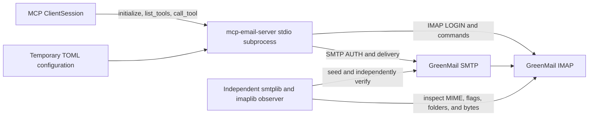

# Validation

The repository includes a Docker-backed black-box baseline for the current
application. It verifies that the installed MCP stdio server can communicate
with real SMTP and IMAP sockets before architecture changes are accepted.

## Run the baseline

Requirements:

- Docker Engine with Docker Compose v2.
- The development environment installed with `uv sync` or `make install`.

Run:

```bash
make test-e2e
```

The command creates a unique Compose project, publishes SMTP and IMAP on
dynamic loopback ports, waits by performing authenticated connections, runs the
E2E test, and removes only that run's container and network even when the test
fails. Concurrent runs and separate worktrees do not share lifecycle ownership.
Each MCP request has a 15-second response deadline so a live but unresponsive
stdio subprocess fails the test instead of hanging indefinitely. The run does
not modify the normal user configuration.

The regular test suite excludes tests marked `e2e` and remains independent of
Docker:

```bash
make test
```

## Tested boundary



The test starts the installed `mcp-email-server` console script as a child
process rather than importing tool functions. The subprocess loads a temporary
plaintext TOML file containing only synthetic test credentials. Python's
standard-library `smtplib`, `imaplib`, and MIME parser act as an independent
seeder and observer, so the system is not solely verifying itself.

## Coverage

| Area          | Assertions                                                                                             |
| ------------- | ------------------------------------------------------------------------------------------------------ |
| MCP lifecycle | stdio subprocess starts, `initialize` succeeds, and expected tools are visible                         |
| Configuration | two accounts load from temporary TOML; SMTP-capable and IMAP-only accounts coexist                     |
| SMTP          | authenticated Alice-to-Bob delivery succeeds through `send_email`                                      |
| IMAP read     | Bob can list metadata and retrieve full content by UID                                                 |
| Attachments   | source bytes arrive in Bob's MIME message, appear in full content, download to disk, and match exactly |
| Sent copy     | Alice receives the application-created copy in `Sent`                                                  |
| Flags         | `mark_emails_as_read` produces `\\Seen`; saved drafts have `\\Draft` and `\\Seen`                      |
| Mailboxes     | the observer provisions `Sent`, `Drafts`, and `Archive`; MCP discovers and uses them                   |
| Mutations     | explicit move, automatic archive selection, draft save, and delete are observed in IMAP                |

`list_emails_metadata` currently fetches headers only and therefore returns an
empty attachment list. Attachment names are verified through
`get_emails_content`, which fetches and parses the complete MIME message. The
baseline records this existing contract rather than silently changing it.

## Isolation and security

The Compose definition:

- pins GreenMail 2.1.11 by both tag and image digest;
- exposes only SMTP and IMAP on dynamically assigned loopback ports;
- gives each invocation a unique Compose project so concurrent cleanup cannot affect another run;
- uses only `example.test` addresses and fixed synthetic passwords;
- disables implicit TLS only inside this local test boundary; and
- never forwards messages to external mail servers.

The application configuration lives in a pytest-managed temporary directory
and contains only the fixed synthetic credentials above. Do not replace the
synthetic accounts with real credentials or personal message data.

## Why GreenMail

[GreenMail](https://greenmail-mail-test.github.io/greenmail/) is designed as a
sandbox mail server for integration tests and provides SMTP and IMAP with a
small, deterministic setup. The repository uses the official
[`greenmail/standalone`](https://hub.docker.com/r/greenmail/standalone) image.

GreenMail is a compatibility baseline, not proof against every provider. This
baseline also does not cover implicit TLS or STARTTLS; those paths retain their
focused unit tests until a dedicated certificate-backed integration service is
added. A future nightly matrix can add a production-oriented server such as
[Stalwart](https://stalw.art/docs/install/platform/docker/) and targeted canary
accounts for provider-specific behavior. Real-provider canaries must use
separate test accounts, minimal retention, and credentials supplied outside the
repository.

## Troubleshooting

The runner prints its unique Compose project name and assigned ports. If a run
is interrupted before cleanup completes, list matching projects with:

```bash
docker compose ls --all | grep mcp-email-server-e2e
```

Use the printed project name to inspect logs or remove only that run:

```bash
docker compose \
  --project-name <printed-project-name> \
  --file dev/greenmail/compose.yml \
  logs greenmail

docker compose \
  --project-name <printed-project-name> \
  --file dev/greenmail/compose.yml \
  down --volumes --remove-orphans
```
