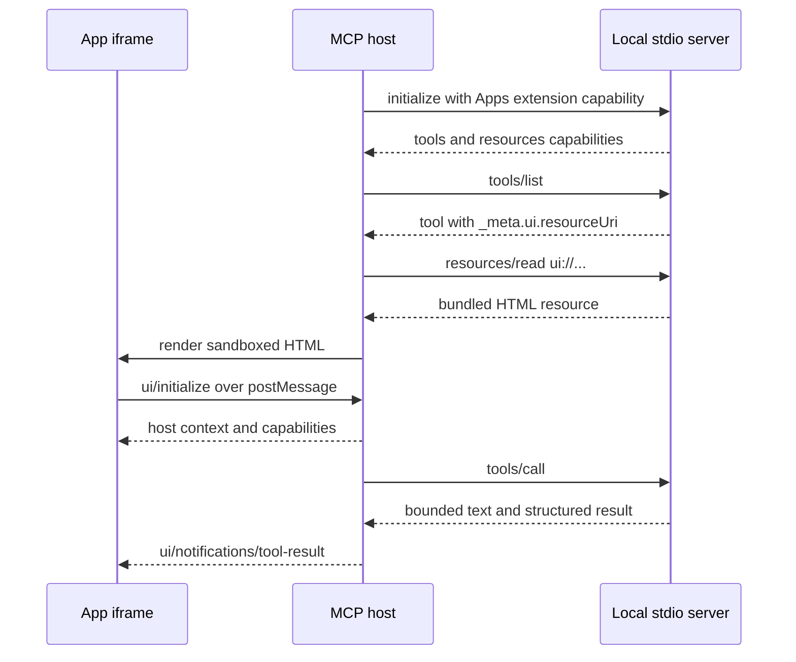
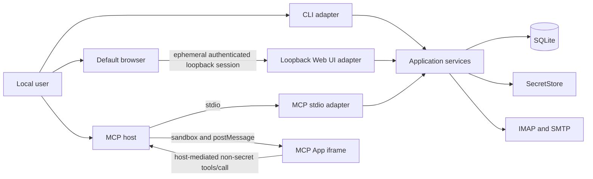

# UI Delivery Strategy for the Local Email App

Status: Research recommendation, not an accepted architecture specification

Research date: 2026-07-18

## Executive Summary

The product should not choose between a local web UI and MCP Apps as if they
were interchangeable. They serve different trust boundaries and different user
jobs.

The recommended product shape is:

1. **An embedded React local Web UI is the primary graphical management
   surface.** It is started explicitly with
   `uvx mcp-email-server@latest ui`, binds only to a loopback address, uses an
   ephemeral port, one-time browser bootstrap, and process session, and exits
   with its CLI process. It
   manages accounts, credentials, policy, migration, diagnostics, index state,
   and cache state by calling the same application services as the CLI.
2. **The CLI remains the headless, recovery, and automation surface.** Secret
   prompts remain available in the terminal even if a browser or Web UI is
   unavailable.
3. **MCP Apps is an optional agent-facing enhancement, not the management
   plane.** It can improve mailbox exploration, review, selection, and other
   non-secret interactions inside capable hosts. Core tools must retain complete
   bounded text results for every other host.
4. **The current Gradio implementation remains a compatibility bridge, not the
   target UI architecture.** The existing `ui` command remains the sole public
   graphical entry point and switches to the React implementation only after the
   replacement reaches its release gate. No separate `webui` command is added.
   The React/Vite frontend is built during release, packaged into the Python
   wheel, and runs through `uvx` without requiring Node.js on the user's machine.

One frontend workspace can serve both graphical surfaces, but it should produce
**two entry points and two bundles**. Shared React components, view models,
validation, and design tokens are reusable. The MCP host bridge, loopback HTTP
client, session security, credential handling, and authorization adapters must
remain separate.

This recommendation preserves the existing product constraints: local,
single-user, no daemon, no hosted service, and stdio as the only target MCP
transport. The Web UI is a temporary local management listener; it is not an MCP
HTTP transport or a remotely supported API.

## Research Questions

This report evaluates:

- the official status and wire model of MCP Apps;
- stdio compatibility and Python SDK maturity;
- support in VS Code, Cursor, Claude, Claude Code, and OpenAI Codex;
- whether an MCP App can safely manage email credentials;
- the current Gradio implementation and `uvx` experience;
- an embedded React distribution model;
- local Web UI security requirements;
- the best division of product responsibilities;
- file-level changes that would be needed in the current architecture proposal.

## Current Repository Baseline

### Existing user experience

The project already documents and supports:

```bash
uvx mcp-email-server@latest ui
```

The command imports `mcp_email_server.ui`, constructs a Gradio `Blocks`
application, and calls `launch(inbrowser=True)`. It currently provides:

- account listing;
- account creation for common IMAP and optional SMTP configurations;
- account deletion;
- operating-system keyring integration through the current settings facade;
- Claude Desktop installation and removal controls.

This proves that a browser-based configuration flow distributed through `uvx`
is viable. It does not prove that the current UI is the right target adapter.

### Architectural gaps in the current Gradio UI

The current `mcp_email_server/ui.py` is a 523-line nested callback module that
calls global configuration functions and Claude Desktop installer helpers
directly. It does not use the proposed `create_runtime()` composition root or
`AccountManagementService`. It therefore cannot naturally inherit the proposed
managed SQLite catalog, persisted secret-change saga, source attribution,
connectivity testing, policy management, index maintenance, or cache management.

Other material gaps are:

- no account edit flow;
- no managed/legacy/environment source distinction;
- no import, migration, repair, or catalog-generation workflow;
- no connectivity test before or after save;
- no index, cache, policy, or diagnostic management;
- no typed interface boundary between callbacks and application services;
- no UI tests; `mcp_email_server/ui.py` is explicitly omitted from coverage;
- no reusable frontend code for an MCP App;
- implicit Gradio launch policy rather than an application-owned local security
  contract.

Gradio 6 defaults to `127.0.0.1` and strict CORS, which are useful defaults, but
`server_name`, `server_port`, and `share` can also be influenced by Gradio
environment variables when the application does not pass explicit values. In
particular, Gradio documents that `GRADIO_SERVER_NAME` can change the bind
address and `GRADIO_SHARE=True` can request a public tunnel. A target management
surface should own and enforce its loopback-only policy rather than inherit
framework environment behavior. See the
[Gradio `Blocks.launch` reference](https://www.gradio.app/docs/gradio/blocks#launch).

The dependency cost is also disproportionate to this product's needs. In the
current lock graph, Gradio brings in pandas, NumPy, Pillow, Hugging Face Hub,
audio helpers, and other general-purpose UI dependencies. An embedded static
frontend can use the ASGI components already required by the MCP Python stack,
with direct dependency declarations for anything imported by the Web UI
adapter.

### `uvx` properties

`uvx` is an alias for `uv tool run`. It executes a package-provided command in
an isolated environment and caches that environment as disposable state. An
`@latest` suffix explicitly refreshes resolution. A persistent
`uv tool install` environment is also available when a stable executable path is
important. These behaviors are documented in the official
[uv tools documentation](https://docs.astral.sh/uv/concepts/tools/).

This gives the desired product experience without a permanent installation:

```bash
uvx mcp-email-server@latest ui
```

It also preserves an existing caveat: disposable or refreshed executable paths
can trigger new operating-system keyring approval behavior on platforms such as
macOS. Documentation should recommend `uv tool install mcp-email-server` when a
stable executable identity is preferred.

## MCP Apps: Verified Protocol Model

### Status and naming

MCP Apps is the official successor and standardization path for earlier MCP-UI
and vendor-specific app patterns. [SEP-1865](https://modelcontextprotocol.io/seps/1865-mcp-apps-interactive-user-interfaces-for-mcp)
is **Final** on the Extensions Track. The extension identifier is
`io.modelcontextprotocol/ui`.

The term **MCP Apps** should be used in product and specification text. MCP-UI
remains relevant as a community SDK and host framework, but it is not the name
of the official extension.

### Two protocol objects

An MCP App always has two server-side parts:

1. a normal MCP tool with `_meta.ui.resourceUri`;
2. a `ui://` resource containing HTML with MIME type
   `text/html;profile=mcp-app`.

A supporting host discovers the tool metadata, reads the resource through
`resources/read`, renders it in a sandboxed iframe, and delivers tool input and
results to the view. The official
[MCP Apps overview](https://modelcontextprotocol.io/extensions/apps/overview),
[versioned specification](https://github.com/modelcontextprotocol/ext-apps/blob/2ca6a59d2f493b227a83a2e3ce0396db4705621a/specification/2026-01-26/apps.mdx),
and [Python SDK guide](https://py.sdk.modelcontextprotocol.io/v2/advanced/apps/)
all describe this model.

### Stdio compatibility

MCP Apps does not require the MCP server to expose HTTP. There are two separate
communication paths:



Host-to-server traffic continues over stdio. View-to-host traffic uses JSON-RPC
2.0 over `postMessage`. The host proxies permitted standard messages such as
`tools/call` to the server. The official React example includes a
[local stdio configuration](https://github.com/modelcontextprotocol/ext-apps/tree/2ca6a59d2f493b227a83a2e3ce0396db4705621a/examples/basic-server-react).

This fits the Local Email App's stdio-only MCP decision. Adding an MCP App does
not justify restoring Streamable HTTP or SSE to the target architecture.

### Negotiation and fallback

Apps is an optional extension. A host advertises
`io.modelcontextprotocol/ui` and supported MIME types during initialization.
The Apps specification requires UI-enabled tools to return meaningful `content`;
this product additionally requires that content to be bounded. The iframe is for
the human, while text remains useful to the model and to hosts without Apps.

For this project, the compatibility contract remains:

```text
static tools + complete bounded text results
```

MCP Apps adds a negotiated rendering path. It does not replace tools, text,
server-side policy, or application pagination.

### Sandbox and host mediation

The specification treats the view as potentially hostile. Its threat model
includes malicious HTML, sandbox escape, unauthorized tool execution, sensitive
host-data exfiltration, phishing, and resource exhaustion. Required or
recommended controls include:

- sandboxed iframes;
- a different-origin sandbox proxy for web hosts;
- deny-by-default CSP built from declared resource metadata;
- predeclared and reviewable resources;
- validated and auditable JSON-RPC messages;
- host control over proxied calls;
- optional user approval for view-initiated actions;
- resource limits and visible UI boundaries.

`_meta.ui.visibility: ["app"]` means that a conforming host must exclude the
tool from the model's tool list while allowing a same-server app to call it. The
host must also reject app calls to tools whose visibility excludes `app`. This
is **not authentication**, proof of local-user intent, or authority to mutate
the SecretStore.

### Credential implication

The Apps specification does not contain a blanket sentence that forbids a
password form. Its data path nevertheless makes the product decision clear:

- the iframe sends tool arguments through a host-controlled `postMessage`
  bridge;
- the host validates, may log, may approve, and proxies `tools/call`;
- the server receives the call only after the host;
- tool input and result notifications can be delivered back to the view;
- the view is explicitly inside the untrusted-content threat model.

Therefore email passwords, OAuth refresh tokens, provider API keys, candidate
secret values, and SecretStore mutation payloads must not pass through an MCP
App. An app-only tool reduces model exposure, but it does not remove the host
from the secret path.

MCP Apps may report safe credential health such as `missing`, `expired`, or
`repair_required`, and may tell the user to run the local Web UI or CLI. It must
not receive a masked secret, raw secret, secret locator, or reusable token.

## Client Support Matrix

The table distinguishes an MCP host's general tool/resource support from actual
MCP Apps rendering. Evidence was checked on 2026-07-18.

| Host surface                | Local stdio MCP               | MCP Apps rendering                                                | Product decision                                          |
| --------------------------- | ----------------------------- | ----------------------------------------------------------------- | --------------------------------------------------------- |
| VS Code with GitHub Copilot | Yes                           | Supported in current official documentation                       | Valid optional Apps target                                |
| Cursor desktop              | Yes                           | Supported since Cursor 2.6 and in current docs                    | Valid optional Apps target; test release regressions      |
| Claude Desktop chat         | Yes                           | Officially supported                                              | Valid optional Apps target                                |
| Claude web/mobile           | Not the same local stdio path | Officially supported for connectors                               | Not a local-product baseline                              |
| Claude Code terminal        | Yes                           | No public inline Apps renderer is documented                      | Text tools only for baseline                              |
| OpenAI Codex CLI/TUI        | Yes                           | No inline HTML surface is documented                              | Text tools only for baseline                              |
| OpenAI Codex IDE extension  | Yes                           | No stable public Apps support is documented                       | Text tools only for baseline                              |
| OpenAI Codex desktop app    | Yes                           | Under-development evidence exists, but an open regression remains | Experimental; do not claim support                        |
| ChatGPT hosted Apps         | Remote MCP-backed app path    | Supported                                                         | Useful portability evidence, not the local stdio baseline |

### Evidence by host

- **VS Code:** the current
  [MCP developer guide](https://code.visualstudio.com/api/extension-guides/ai/mcp)
  lists MCP Apps among supported features. The
  [January 2026 announcement](https://code.visualstudio.com/blogs/2026/01/26/mcp-apps-support)
  introduced full support in Insiders and announced the following stable
  rollout.
- **Cursor:** current
  [Cursor MCP documentation](https://cursor.com/docs/mcp#protocol-and-extension-support)
  lists Apps as supported and describes progressive enhancement. The
  [Cursor 2.6 changelog](https://cursor.com/changelog/2-6) records the shipped
  feature.
- **Claude:** Anthropic's
  [interactive connectors announcement](https://claude.com/blog/interactive-tools-in-claude)
  states that MCP Apps are available in Claude mobile, web, and desktop. The
  official MCP Apps overview separately lists Claude Desktop. This evidence is
  for Claude product surfaces, not automatically for the Claude Code terminal.
- **Claude Code:** its extensive
  [MCP documentation](https://code.claude.com/docs/en/mcp) documents stdio,
  tools, resources, prompts, elicitation, refresh, approval, and OAuth, but does
  not document an MCP Apps iframe renderer. Absence is reported as no public
  confirmation, not proof that no private or future build can render Apps.
- **Codex:** current
  [Codex MCP documentation](https://learn.chatgpt.com/docs/extend/mcp) documents
  stdio, Streamable HTTP, server instructions, tool controls, and approvals but
  does not list Apps as a supported server feature. The open
  [Codex issue #21019](https://github.com/openai/codex/issues/21019) records an
  under-development feature path and continuing desktop rendering regressions.
  It is implementation evidence, not a stable product contract.
- **ChatGPT:** OpenAI documents
  [MCP Apps compatibility in ChatGPT](https://developers.openai.com/apps-sdk/mcp-apps-in-chatgpt),
  including the standard iframe bridge. ChatGPT-specific APIs remain optional
  vendor extensions and should not enter the portable bundle.

### Compatibility conclusion

MCP Apps has meaningful adoption, but it still cannot be the only UI. A user who
runs Claude Code or Codex must not lose graphical account management merely
because that MCP host does not render the optional extension. A normal local Web
UI works independently of the MCP host and is therefore the only portable
primary graphical surface.

## Python SDK Maturity

The repository currently resolves `mcp==1.26.0` under `mcp>=1.23.0,<2`. The
installed FastMCP APIs can attach arbitrary tool and resource metadata, but the
installed package has no `mcp.server.apps` module or first-class Apps extension
negotiation API.

As of the research date:

- PyPI's latest stable MCP Python SDK is 1.28.1;
- MCP Python SDK 2.0 has beta releases;
- the official v2 guide contains the first-class `Apps`, `APP_MIME_TYPE`,
  `client_supports_apps`, resource CSP, permissions, and visibility APIs.

See [MCP on PyPI](https://pypi.org/project/mcp/) and the
[official v2 Apps guide](https://py.sdk.modelcontextprotocol.io/v2/advanced/apps/).

A local React Web UI does not depend on MCP Apps SDK maturity and can proceed
against application services. The MCP App adapter should wait for either:

1. a stable Python SDK 2 release with tested FastMCP or low-level server
   integration; or
2. a deliberately maintained thin protocol adapter with conformance tests.

Shipping production behavior on a beta SDK solely to obtain Apps support is not
recommended. Manually emitting pre-GA compatibility aliases is also not a sound
cross-host contract.

## Embedded React Is Feasible

### Distribution model

The official MCP Apps React example uses React, Vite,
`@vitejs/plugin-react`, and `vite-plugin-singlefile`. It compiles the UI into one
`dist/mcp-app.html`, which the server reads and returns as an MCP resource. See
the official
[React example](https://github.com/modelcontextprotocol/ext-apps/tree/2ca6a59d2f493b227a83a2e3ce0396db4705621a/examples/basic-server-react),
[`vite.config.ts`](https://github.com/modelcontextprotocol/ext-apps/blob/2ca6a59d2f493b227a83a2e3ce0396db4705621a/examples/basic-server-react/vite.config.ts),
and
[`server.ts`](https://github.com/modelcontextprotocol/ext-apps/blob/2ca6a59d2f493b227a83a2e3ce0396db4705621a/examples/basic-server-react/server.ts).

For this Python project:

1. Node.js and npm are maintainer and release-build dependencies only.
2. CI builds each frontend surface selected for the release before building the
   Python source distribution and wheel.
3. Built assets and required third-party license material are copied into the
   `mcp_email_server` package under explicit Hatch sdist and wheel inclusion
   rules.
4. Python reads packaged assets through `importlib.resources`.
5. Both published artifacts are self-contained: a wheel rebuilt from the sdist
   in an environment without Node.js must contain the same assets and run
   normally under `uvx`.

Python's standard
[`importlib.resources`](https://docs.python.org/3/library/importlib.resources.html)
API supports text and binary resources stored inside packages, including
non-filesystem package loaders.

### One workspace, two entry points

The target should not use one bundle that guesses whether a parent MCP host
exists. That makes bootstrap, authorization, CSP, error handling, and secret
code harder to audit.

Use one frontend workspace that can grow explicit entry points. The following
is the eventual layout after an MCP App use case and SDK adoption are accepted:

```text
frontend/
  src/
    shared/
      components/
      forms/
      view-models/
      validation/
      design-tokens/
    adapters/
      loopback-web/
      mcp-app/
    ui.tsx
    mcp-app.tsx
  ui.html
  mcp-app.html
  vite.config.ts
  package.json
  package-lock.json
```

Eventual build outputs:

```text
mcp_email_server/
  static/
    ui/
      index.html
      assets/...
    mcp-app/
      mcp-app.html
```

The first implementation should create and package only the local `ui` frontend
entry point. Add the MCP entry point, browser SDK dependency, single-file bundle,
and wheel assertion
when the read-only MCP App prototype starts and its actual shared DTOs and
components are known. At that point the MCP App should normally be a
self-contained single HTML resource. The local Web UI may use a conventional
hashed static asset directory because it is served same-origin by its own
loopback process.

### Safe reuse boundary

Share:

- presentational React components;
- non-secret account summary and health view models;
- form layout and non-secret validation;
- loading, error, and operation-state components;
- accessibility primitives;
- design tokens and a theme abstraction;
- generated TypeScript DTO types for public interface payloads.

Do not share as one implementation:

- MCP `postMessage` bridge and loopback HTTP client;
- MCP capability negotiation and local Web UI session bootstrap;
- host display modes and browser routing;
- app-tool visibility and management authorization;
- secret input and SecretStore mutation;
- MCP resource CSP and Web UI HTTP response headers;
- host-mediated tool approvals and local management confirmations;
- transport-specific error mapping and retry behavior.

This is an adapter split, not duplicated business logic. Both Python interfaces
call the same application services.

## Product Surface Ownership

| User job                         | CLI                   | Local Web UI                        | MCP App                                             |
| -------------------------------- | --------------------- | ----------------------------------- | --------------------------------------------------- |
| Initialize managed mode          | Primary fallback      | Primary graphical flow              | Not allowed                                         |
| Add/edit/remove account          | Supported             | Primary graphical flow              | Not allowed                                         |
| Enter/rotate/delete secret       | Masked prompt         | Primary graphical flow              | Not allowed                                         |
| Import or repair legacy config   | Supported             | Guided flow                         | Status and remediation only                         |
| Configure allowlists and roots   | Supported             | Primary graphical flow              | Read-only summary at most                           |
| Test connectivity                | Supported             | Primary graphical flow              | Safe status only                                    |
| Manage index/cache               | Supported             | Primary graphical flow              | Bounded status or refresh action later              |
| Discover account capability      | Supported             | Supported                           | Supported                                           |
| Explore message metadata         | Optional diagnostics  | Optional                            | Strong Apps use case                                |
| Select messages for review       | Not optimized         | Possible                            | Strong Apps use case                                |
| Read message text                | Supported diagnostics | Possible, escaped                   | Optional, bounded plain text only initially         |
| Send/move/delete mail            | Supported             | Possible with explicit confirmation | Later, only through normal policy and host approval |
| Recovery when browser/host fails | Primary               | Unavailable                         | Unavailable                                         |

The first MCP App should be read-oriented: account health and bounded metadata
exploration. Sending, moving, deleting, attachment materialization, and rendered
email HTML should not be the initial Apps scope.

## Recommended Runtime Architecture



There is deliberately no edge from the MCP App iframe to the local Web UI.
Adding `http://127.0.0.1:*` to an MCP App's `connectDomains` would merge an
untrusted host iframe into the management API's CORS, CSRF, and authorization
boundary. The MCP App should use host-mediated non-secret tools only. If
management is required, it displays the `ui` or CLI command.

## Local Web UI Security Contract

A loopback listener is local, but it is still reachable by the user's browser
while the browser visits attacker-controlled sites. The MCP specification's
[Streamable HTTP security warning](https://modelcontextprotocol.io/specification/2025-11-25/basic/transports#security-warning)
normatively requires Origin validation for that MCP transport and recommends
loopback-only binding and authentication. The Web UI is not an MCP transport,
so those statements are not directly normative for it. The DNS-rebinding and
cross-origin attack class still applies, and the controls below are this
product's threat analysis and deliberately strong local-management policy.

### Required launch behavior

- Bind exactly to `127.0.0.1` by default, not `0.0.0.0` and not an inferred
  network interface.
- Let the OS choose an ephemeral port by default.
- Generate a cryptographically random, one-time bootstrap capability plus
  process-local browser session and CSRF material.
- Open the browser only after the socket is listening.
- Put the one-time bootstrap capability in the URL fragment, not the path or
  query: `http://127.0.0.1:<port>/#bootstrap=<one-time-token>`.
- Have the SPA submit it once in an authorization header to a same-origin
  bootstrap endpoint, clear the fragment with `history.replaceState`, and never
  render management data before the exchange succeeds.
- Invalidate the bootstrap capability atomically and establish a process-scoped,
  `HttpOnly`, `SameSite=Strict` browser session with a process-unique cookie name
  and narrow server-generated path. Move the browser to that path and return
  separate CSRF material through the authenticated response.
- On reload, let the session cookie authenticate a safe session-bootstrap GET
  that returns fresh CSRF material. The session ends on explicit logout or when
  the foreground process exits; it has no independent persisted TTL.
- Stop on Ctrl-C and close runtime resources. Do not detach, register a service,
  or become an implicit daemon.
- Never provide a share link or non-loopback bind option in the supported
  product command.

### Required request checks

- Validate `Host` against the exact loopback origin and active port.
- Validate the bootstrap request's `Origin` and require an exact same-origin
  `Origin` plus CSRF header for every state-changing request.
- Do not enable CORS. Reject wildcard, `null`, missing, or unexpected origins
  where an Origin is required.
- Permit only safe, non-mutating GET routes without an Origin; they still require
  a valid `SameSite=Strict` process session. Every mutation requires JSON so a
  cross-site HTML form cannot be interpreted as an API call.
- Make the fragment capability single-use and reject replay. Keep browser
  sessions and CSRF material process-local; never persist them in SQLite.
- Rate-limit authentication failures and make secret comparisons timing-safe.
- Return bounded typed errors without stack traces, secret values, SQL, or raw
  provider failures.

### Management revision contract

A long-lived browser tab is a concurrent management adapter, not an exclusive
editor. Every mutable Web request must carry the account, catalog, policy,
credential-binding, or other expected revision represented by the form it
rendered. The application service performs the same compare-and-swap contract
for CLI and Web UI writes.

A stale request returns a typed conflict with a bounded current summary. The Web
adapter must not silently merge or automatically replay a whole-form account,
policy, import, or credential change. The user reviews the new state and submits
a new explicit command. MCP operations and background refreshes continue to use
their existing generation and effect-boundary rules.

### Required browser policy

At minimum, send:

```text
Cache-Control: no-store
Content-Security-Policy: default-src 'self'; connect-src 'self'; img-src 'self' data:; style-src 'self'; script-src 'self'; object-src 'none'; base-uri 'none'; frame-ancestors 'none'; form-action 'self'
Referrer-Policy: no-referrer
X-Content-Type-Options: nosniff
```

Do not use CDN scripts, remote fonts, third-party analytics, service workers, or
`dangerouslySetInnerHTML`. Account names, mailbox names, subjects, provider
errors, and email-derived values are untrusted text and must remain escaped.

### Secret form behavior

- Send secret values only in authenticated JSON request bodies.
- Do not echo them in responses, validation errors, telemetry, or browser state.
- Keep them out of URLs, local storage, session storage, IndexedDB, and service
  workers.
- Clear component state after success or cancellation.
- Resolve and store them only through `AccountManagementService` and
  `SecretStore` saga contracts.
- Keep the CLI masked prompt as a lower-exposure alternative for users who do
  not want to enter secrets in a browser.

### Local adversary assumptions

The Python package, built frontend assets, current operating-system account, and
selected browser profile are trusted. A malicious process already running as
that same user, a malicious browser extension in that profile, or an observer
that can read terminal recordings or browser-launch process arguments is out of
scope; such an actor can usually inspect process state, configuration, or
keyring access by other means. The launch capability is nevertheless one-time so
exposure through the launch channel does not reveal the process-long session.

Remote web origins, MCP views and content, email-derived data, and local users or
processes that have not obtained the one-time capability are untrusted.
Loopback TCP is machine-local rather than user-isolated, so the capability is
still required on a multi-user machine; this design does not claim strong
isolation from a privileged local adversary. Users with an untrusted same-user
environment should use the masked CLI flow or stronger operating-system
isolation.

HTTPS with a self-signed local certificate would add substantial trust and
installation friction without changing that same-user trust assumption. An
optional future platform integration may revisit local TLS, but it is not
required for the first local product.

### OAuth

If managed accounts later support OAuth, launch authorization in the system
browser and use a narrowly scoped loopback callback with single-use `state`,
PKCE, an ephemeral port, and a bounded callback lifetime. RFC 8252 recommends
external user agents and documents loopback redirects for native apps. See
[OAuth 2.0 for Native Apps](https://www.rfc-editor.org/rfc/rfc8252).

The callback handler must suppress or redact access logging of the request query
because it contains the authorization code and state. Provider and token-exchange
failures must also be redacted. OAuth refresh tokens terminate in `SecretStore`;
they do not return to React or an MCP App after the callback completes.

## Command Experience

Recommended canonical command:

```bash
uvx mcp-email-server@latest ui
```

Recommended options:

```text
--no-open       Start without opening a browser.
--port INTEGER  Bind a chosen loopback port; default 0 means ephemeral.
```

Do not expose `--host`, `--share`, or remote authentication options. Those
options would turn a local adapter into a network product and contradict the
current product direction.

Expected terminal flow:

```text
Starting the local Email App management UI...
Listening on http://127.0.0.1:54321/
The browser session is temporary. Press Ctrl-C to stop.
```

The browser receives a one-time bootstrap capability through the automatically
opened fragment URL; automatic mode prints only the sanitized base URL. If
`--no-open` is used, the terminal may print the full one-time URL with a warning
that whoever uses it first can establish the browser session. A normal reload
continues through the process-scoped session cookie. If that cookie is cleared,
the user restarts the foreground command to obtain a new bootstrap capability.

`mcp-email-server ui` remains the sole canonical graphical command throughout
the migration. Before the replacement release it starts Gradio; once the React
adapter reaches the accepted parity, security, packaging, and documentation
gates, the same command starts React instead. The project does not add a
`webui` command. This semantic replacement still follows the project's versioned
compatibility and published-documentation rules.

## Route Comparison

| Route                              | Coverage                                     | Secret suitability               | UX                                   | Implementation fit                     | Recommendation             |
| ---------------------------------- | -------------------------------------------- | -------------------------------- | ------------------------------------ | -------------------------------------- | -------------------------- |
| CLI only                           | Universal local                              | Strong                           | Weak for discovery and complex forms | Already aligned                        | Keep as mandatory fallback |
| Expand current Gradio              | Browser universal                            | Acceptable if hardened           | Moderate                             | Poor reuse and current direct coupling | Compatibility only         |
| Embedded React local Web UI        | Browser universal                            | Strong within local threat model | Strong                               | Clean peer adapter over services       | Primary graphical surface  |
| MCP Apps only                      | Host-dependent                               | Unsuitable for raw secrets       | Excellent when rendered              | SDK and host gaps                      | Reject as management plane |
| React Web UI plus optional MCP App | Universal management plus rich capable hosts | Correctly separated              | Strongest overall                    | Two thin adapters, shared components   | Recommended target         |

The hybrid route has more frontend integration work than one UI, but it avoids
building two unrelated frontends. The additional code is concentrated in two
small transport/trust adapters, which is appropriate because the boundaries are
materially different.

## Implementation Direction

This is not an implementation plan or an accepted spec change. If the direction
is accepted, a low-risk sequence is:

1. Complete the application service and composition-root boundaries already
   proposed. Do not let a new UI grow against global `Settings`.
2. Create a minimal React workspace with only the Web UI entry point and a locked
   dependency graph.
3. Implement the loopback Web UI adapter and security contract.
4. Package the built Web UI in both sdist and wheel, then add from-sdist,
   isolated-wheel, and `uvx` smoke tests that run without Node.js.
5. Switch the implementation behind the existing `ui` command only after
   account-management parity and migration documentation exist.
6. After the Python SDK Apps API is stable and a read-only workflow is accepted,
   add the MCP App entry point, browser SDK dependency, single-file bundle, and
   host-specific validation for current VS Code, Cursor, and Claude Desktop.
7. Keep complete text fallback behavior and never make the MCP App a setup
   prerequisite.

### Suggested Python ownership

```text
mcp_email_server/
  interfaces/
    cli.py
    mcp.py
    ui/
      app.py
      auth.py
      routes.py
      schemas.py
  static/
    ui/
    mcp-app/  # added only when the optional MCP App ships
```

The Web UI adapter may use a small ASGI stack such as Starlette and Uvicorn.
Any directly imported runtime package should be declared directly even if it is
already transitive through `mcp`. The adapter should not expose OpenAPI,
framework debug endpoints, filesystem browsing, or a generic RPC method unless
the product needs them.

### Build and release requirements

- Pin the Node package manager and commit its lockfile.
- Build currently shipped production assets before creating release artifacts.
- Declare generated assets and required third-party license material explicitly
  in Hatch sdist and wheel inclusion rules; fail release creation if a required
  artifact is missing.
- Inspect both sdist and wheel contents. The sdist must carry the prebuilt assets
  so its PEP 517 build does not require Node.js.
- In an environment without Node.js, build a wheel from the sdist, inspect it,
  install it in isolation, and start `ui`.
- Assert only the frontend outputs shipped by that release. Add the MCP App HTML
  assertion and verify its single-resource/CSP contract when the optional App
  adapter is introduced.
- Treat frontend dependency changes like Python dependency changes: review,
  lock, scan, update, and preserve notices together.

## Testing Requirements

### Web UI backend

- exact loopback bind and no wildcard bind;
- ephemeral and fixed loopback ports;
- Host and Origin rejection, including DNS rebinding cases;
- missing, invalid, valid, and replayed one-time bootstrap capabilities;
- session establishment, normal reload, logout, and process termination;
- CSRF rejection and no CORS or public/share mode;
- security response headers;
- bounded error redaction;
- stale account form, concurrent policy edit, and concurrent credential-change
  revision conflicts with no automatic replay;
- clean shutdown and concurrent SQLite access;
- application-service calls rather than direct config/database access;
- if OAuth enters scope, single-use state and absence of callback query values
  from access logs, diagnostics, and provider-error output.

### React Web UI

- account create, edit, disable, remove, connectivity test, and secret rotation
  against fake application ports;
- secret values absent from URLs, storage, logs, and rendered success state;
- untrusted strings rendered as text;
- keyboard and screen-reader behavior;
- management confirmation, typed revision-conflict review, and error-recovery
  states;
- frontend route/client tests without live email services.

### Packaging

- frontend build reproducibility;
- explicit sdist and wheel content assertions, including license material;
- wheel construction from the sdist in an environment without Node.js;
- isolated installation of that rebuilt wheel;
- `uvx` or equivalent tool-run smoke test with `--no-open`;
- browser bootstrap, reload, and authenticated health request;
- no Node executable required by either published artifact at consumer build or
  runtime.

### MCP App

- extension negotiation and MIME type;
- tool-to-resource linkage;
- meaningful complete text with Apps disabled;
- bundled resource loading through stdio;
- no external CSP domains by default;
- app-only tool filtering and server-side policy;
- no credential fields or secret references in schemas, tool input, results, or
  app state;
- bounded structured results;
- manual compatibility evidence for each claimed host release.

MCP Inspector proves protocol shape, not host rendering compatibility. Product
claims still require host-specific evidence.

## Proposed Specification Changes

No spec files are changed by this research report. If the recommendation is
accepted, update the owning specifications before implementation.

### `spec/README.md`

- Add the explicitly started loopback Web UI as a peer management adapter.
- Keep stdio as the only MCP transport.
- Replace “web application or MCP App user interface” as a blanket non-goal with
  narrower non-goals: remote Web UI, hosted UI, and a UI daemon.
- State the surface split: CLI and Web UI own management; MCP Apps is an optional
  agent-facing enhancement. Summarize the secret boundary and cross-reference
  `07` as its normative UI-surface owner.
- Add a new owning UI/security spec to the map.
- Update the architecture diagram with Browser, Web UI adapter, and optional MCP
  App view.

### `spec/01-system-context.md`

- Add Browser and MCP App view actors.
- Add an explicit Web UI process model: user-started, loopback-only, temporary,
  no daemon.
- Extend trust boundaries for hostile web origins, DNS rebinding, CSRF, iframe
  content, and browser-delivered untrusted email data.
- Keep the local operating-system user as the only product principal.
- Change secret-bearing management from “CLI only” to “CLI or authenticated
  local Web UI”; continue excluding MCP.

### `spec/02-application-boundaries.md`

- Add `WebManagementAdapter` as a peer of CLI and MCP.
- Add the MCP App resource/metadata mapping as part of the MCP adapter, not a new
  application service.
- Add web route schemas and React assets to interface ownership.
- Keep browser bootstrap, session, and CSRF state process-local to the adapter;
  do not add it to domain models or SQLite repositories.
- Preserve the rule that interfaces do not depend on one another. The MCP App
  must not call the Web UI adapter.
- Update the target package ownership and interface tests.

### `spec/03-configuration-and-credentials.md`

- Own the definition and lifecycle of secret material, including passwords,
  tokens, `SecretRef`s, candidate bindings, and the persisted secret-change
  saga.
- Define CLI and local Web UI as management adapters that invoke that saga;
  cross-reference the UI authorization and forbidden-path contract in `07`.
- Generalize “Account Revisions and Concurrent CLI Writes” to all management
  adapters. Every mutable request carries its inspected revision; stale Web
  forms return a typed current summary and are never replayed automatically.
- Own SecretStore behavior for OAuth results if OAuth enters scope, while
  cross-referencing `07` for browser callback security and logging.
- Extend import, repair, and rotation sequences to say “management adapter”
  where they currently say only CLI, while retaining masked CLI recovery.

### `spec/04-mail-workflows-and-consistency.md`

- State that UI actions map to the same commands and preserve the same provider
  effect fencing and reconciliation semantics.
- Do not create UI-specific send, move, or delete consistency rules.
- Require explicit confirmation rendering for compound or ambiguous outcomes.

### `spec/05-sqlite-persistence-and-data-model.md`

- State that Web UI bootstrap capabilities, browser sessions, CSRF material, and
  view state are process-local and never persisted.
- No application schema change should be needed solely to add a UI adapter.

### `spec/06-mcp-interface-and-client-compatibility.md`

- Add MCP Apps as a negotiated optional extension.
- Add the Apps-specific host matrix while retaining the existing core MCP
  matrix.
- Define meaningful text fallback as required by Apps and retain the product's
  stricter bounded, complete text contract.
- Define the initial read-only Apps scope. Cross-reference `03` for secret
  classification and `07` for the prohibition on secret-bearing UI paths rather
  than restating either contract.
- Own `ui://`, `text/html;profile=mcp-app`, resource CSP, tool visibility,
  negotiation, and host-mediated calls.
- Record Python SDK maturity and the condition for adopting the official Apps
  API.
- Update the “Existing Non-stdio Entry Points” section to distinguish the new
  local management Web UI from MCP network transports.

### New `spec/07-local-ui-surfaces-and-security.md`

This should own contracts that would otherwise be scattered:

- user jobs and surface ownership;
- explicit Web UI lifecycle, one-time bootstrap exchange, process session,
  reload, logout, and shutdown;
- loopback bind, Host/Origin/CSRF checks, browser headers, and local-adversary
  assumptions;
- embedded frontend and sdist/wheel packaging;
- staged React entry points and their reuse boundary;
- UI surface authorization and threat model, including the single owning
  prohibition on secret-bearing MCP App paths;
- OAuth browser callback constraints if OAuth enters scope;
- UI, concurrency, and packaging validation.

It should be an architecture contract, not a screen-by-screen design or release
plan.

## Product Decision: Canonical UI Command

The existing `ui` command remains the sole public graphical management command.
The React implementation replaces Gradio behind that command after the accepted
release gates; the product does not add a `webui` command. If the UI direction is
accepted, the owning specifications must record this command contract before the
replacement ships.

## Open Decisions Before Spec Acceptance

1. The exact ASGI implementation. The recommendation is a small explicit
   Starlette/Uvicorn adapter, not a generic network API framework.
2. Whether the first Web UI release includes only account and credential
   management or also index/cache diagnostics. Account parity and secure secret
   handling are the minimum useful release.
3. The first MCP App workflow. The recommendation is bounded account health and
   metadata exploration, not compose/send or raw HTML mail rendering.
4. The Python SDK adoption threshold. The recommendation is stable v2 plus host
   conformance tests, rather than beta adoption.

## Limitations

- This is a source and architecture review, not a working React/Web UI prototype
  or a usability study with email users.
- Host compatibility is based on public product documentation, release evidence,
  and clearly labeled implementation issues. It was not re-tested in every
  current proprietary host build, and host regressions can change the matrix.
- The proposed loopback controls have not yet received implementation-level
  penetration testing. The final adapter needs security tests against its exact
  HTTP framework and browser bootstrap code.
- Python SDK 2 is still pre-release as of the research date. Its API and FastMCP
  integration may change before the project adopts it.
- The local threat model assumes the operating-system user, selected browser,
  Python package, and built frontend assets are trusted. It does not attempt to
  isolate the app from a malicious process already running as that same user.

## Final Recommendation

Adopt the following product decision:

> The Local Email App provides a CLI and an explicitly started, loopback-only
> embedded React Web UI as trusted local management adapters over shared
> application services. It may additionally expose negotiated MCP Apps for
> non-secret agent-facing workflows over the existing stdio MCP connection.
> MCP Apps never own account credentials or replace complete text tool results.
> The existing `ui` command is the sole graphical management entry point and the
> React implementation replaces Gradio behind it.

This gives users a first-class graphical product through the command they
already know how to run with `uvx`, while using MCP Apps where they are strongest:
in-context interaction inside capable hosts. It also avoids turning optional
host support into a setup dependency or weakening the credential boundary.

## Sources

1. [MCP Apps overview](https://modelcontextprotocol.io/extensions/apps/overview) — protocol pattern, security model, frameworks, and supported clients.
2. [SEP-1865](https://modelcontextprotocol.io/seps/1865-mcp-apps-interactive-user-interfaces-for-mcp) — Final extension status, rationale, and security implications.
3. [MCP Apps specification at the reviewed commit](https://github.com/modelcontextprotocol/ext-apps/blob/2ca6a59d2f493b227a83a2e3ce0396db4705621a/specification/2026-01-26/apps.mdx) — normative resource, bridge, lifecycle, visibility, CSP, negotiation, and threat-model details.
4. [MCP Apps build guide](https://modelcontextprotocol.io/extensions/apps/build) — Vite single-file build and server/resource pattern.
5. [Official MCP Apps React example](https://github.com/modelcontextprotocol/ext-apps/tree/2ca6a59d2f493b227a83a2e3ce0396db4705621a/examples/basic-server-react) — React entry point, stdio server, and single-file bundle.
6. [MCP Python SDK v2 Apps guide](https://py.sdk.modelcontextprotocol.io/v2/advanced/apps/) — Python APIs, graceful degradation, visibility, CSP, and packaged file resources.
7. [VS Code MCP developer guide](https://code.visualstudio.com/api/extension-guides/ai/mcp) — current supported MCP features including Apps.
8. [VS Code MCP Apps announcement](https://code.visualstudio.com/blogs/2026/01/26/mcp-apps-support) — release evidence and product behavior.
9. [Cursor MCP documentation](https://cursor.com/docs/mcp#protocol-and-extension-support) — current Apps and stdio support.
10. [Cursor 2.6 changelog](https://cursor.com/changelog/2-6) — shipped Apps release evidence.
11. [Claude interactive connectors announcement](https://claude.com/blog/interactive-tools-in-claude) — Claude surface support.
12. [Claude Code MCP documentation](https://code.claude.com/docs/en/mcp) — documented Claude Code MCP surface and current evidence boundary.
13. [Codex MCP documentation](https://learn.chatgpt.com/docs/extend/mcp) — documented Codex MCP transports and features.
14. [Open Codex Apps rendering issue #21019](https://github.com/openai/codex/issues/21019) — under-development and regression evidence; not a stable support claim.
15. [MCP Apps compatibility in ChatGPT](https://developers.openai.com/apps-sdk/mcp-apps-in-chatgpt) — standard bridge compatibility and optional vendor extensions.
16. [uv tools documentation](https://docs.astral.sh/uv/concepts/tools/) — `uvx` execution, caching, versions, and persistent tool installation.
17. [Python `importlib.resources`](https://docs.python.org/3/library/importlib.resources.html) — reading packaged static resources.
18. [MCP transport security](https://modelcontextprotocol.io/specification/2025-11-25/basic/transports#security-warning) — loopback binding, Origin validation, authentication, and DNS rebinding.
19. [RFC 8252](https://www.rfc-editor.org/rfc/rfc8252) — external browser and loopback redirect best practices for native-app OAuth.
20. [Gradio `Blocks.launch`](https://www.gradio.app/docs/gradio/blocks#launch) — current launch, bind, share, and strict-CORS behavior.
