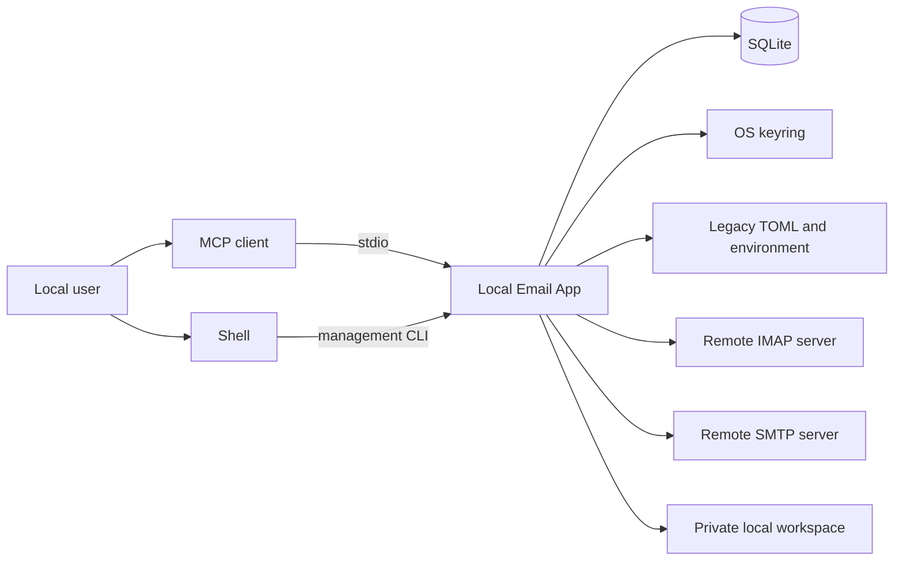
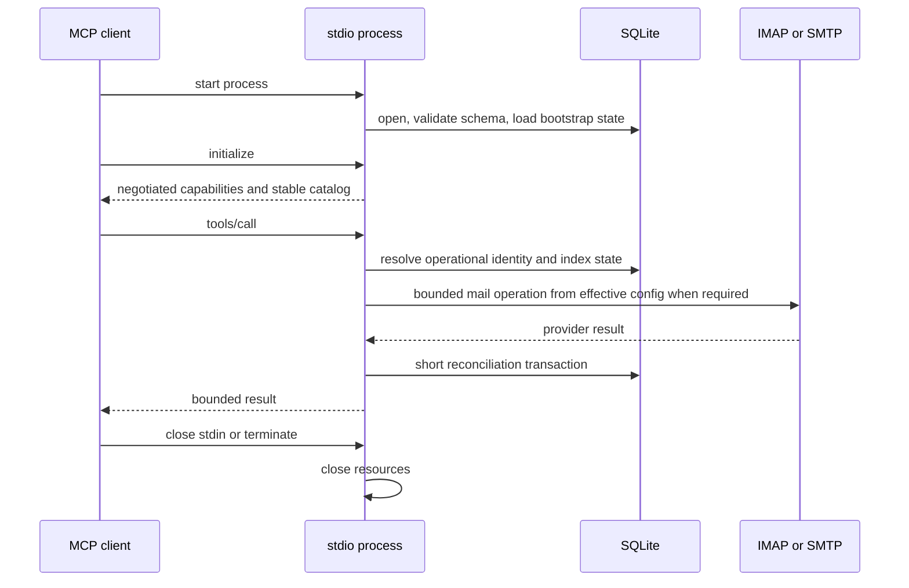

# 01. System Context

Status: Proposed

Previous: [`README.md`](README.md)
Next: [`02-application-boundaries.md`](02-application-boundaries.md)

## Purpose

The target product is a local Email App for one operating-system user. It
connects to existing IMAP and SMTP services, maintains a performant local index
in SQLite, exposes mail operations to MCP clients over stdio, and exposes local
management through a CLI.

The application is not a mail server. IMAP remains authoritative for mailbox
contents and flags, and SMTP remains authoritative for delivery acceptance.
SQLite accelerates discovery, search, and repeated reads and records enough
local state to reconcile non-atomic mail workflows.

## Actors and External Systems

### Local user

The local user chooses the accounts, credential backend, sender and recipient
policies, index scope, cache limits, and client configuration. Filesystem and
keyring access run with that user's operating-system permissions.

### MCP client

The MCP client starts one server subprocess and exchanges newline-delimited MCP
messages over stdin and stdout. It may independently decide how tools,
resources, prompts, approvals, and structured results appear to the user.

### Management CLI

The CLI is the trusted local management plane. It accepts secret input through a
masked prompt, manages the SQLite catalog, imports legacy configuration,
validates account connectivity, and performs explicit index and cache
maintenance. Secret-bearing account creation is not a target MCP workflow.

### IMAP and SMTP services

IMAP supplies mailbox structure, message metadata, bodies, flags, and mutation
results. SMTP accepts outbound messages. Provider-specific capabilities remain
behind mail adapters.

## Goals

- Separate MCP and CLI mapping from email policy, persistence, secrets, and
  provider protocols.
- Make common mailbox listing and search operations fast through a local SQLite
  metadata index.
- Reuse indexed state across independent MCP and CLI processes.
- Preserve current TOML, environment, and keyring configurations while providing
  an explicit path into the managed SQLite catalog.
- Keep credentials out of ordinary database rows and model-visible MCP input.
- Bound tool schemas and results so a large mailbox or message cannot exhaust an
  LLM context window.
- Preserve mail consistency rules across the MCP and CLI interfaces.
- Keep the architecture understandable: introduce only boundaries required by
  the local product.

## Non-goals

- Streamable HTTP, SSE, remote MCP access, or a hosted API.
- Multi-user, tenant, role, or remote authentication models.
- A daemon, scheduler, or always-running background synchronizer.
- Replacing IMAP with a complete offline replica.
- Persisting all bodies, raw MIME, or attachment payloads.
- Supporting interchangeable SQL engines.
- Building a web UI or MCP App as part of this proposal.
- Moving secrets into unencrypted SQLite columns.
- Guaranteeing exactly-once behavior across ambiguous SMTP or IMAP network
  failures.

An additional interface could be designed later because application services do
not import FastMCP, but this proposal defines no remote transport abstractions.

## Process Model

### MCP process

The MCP client owns the stdio subprocess lifecycle:

1. the process resolves bootstrap settings and opens the local database;
2. it validates or applies SQLite migrations;
3. it constructs repositories, secret stores, mail gateways, policies, and
   application services;
4. it constructs a stable MCP server and completes capability negotiation;
5. it handles tool requests until stdin closes or the process is terminated;
6. it closes mail sessions and database resources before exit when possible.

The process does not start an independent synchronization loop. Metadata refresh
occurs within an explicit tool request or management command.

### CLI process

Each CLI command creates the same application runtime with a CLI adapter. It may
run concurrently with a client-owned MCP process against the same SQLite file.
Commands therefore use short transactions, revisions, and idempotent upserts;
they do not assume exclusive process ownership.

## Runtime State

Runtime state is deliberately small:

- immutable bootstrap settings for database location, compatibility mode, and
  only the safety ceilings required before SQLite can be opened;
- process-local environment overlays captured at startup;
- a stable application service graph;
- lazy, bounded IMAP and SMTP sessions;
- SQLite connections owned by the persistence adapter;
- cancellation and correlation context for the current operation.

Managed accounts and managed policy are read through revision-aware repositories
rather than copied into mutable global settings. Legacy and environment accounts
reuse SQLite operational identities without becoming managed configuration rows.
Ordinary updates within the same mode become visible to the next MCP operation
without replacing the tool catalog. Managed-mode cache, index, artifact, and
mutation policy comes from SQLite; legacy compatibility policy remains in its
TOML/environment adapter. Bootstrap holds only pre-database safety ceilings.

A mode/catalog-generation transition requires a stdio restart. For mutations,
the attempt's effect-boundary transition verifies generation atomically with
advancing to `REMOTE_EFFECT_POSSIBLE` or its typed equivalent. An older process
therefore returns `RESTART_REQUIRED` without a new provider side effect if the
catalog transition committed first. A provider call whose boundary committed
first may finish and reconcile with its original validated snapshot; every later
independent side-effect substep checks generation again.

## Local Concurrency Model

SQLite is shared by local processes, not by tenants or remote users.

- WAL mode allows readers while another process commits a short write.
- A bounded busy timeout handles brief writer contention.
- Database migrations and destructive maintenance use an explicit local lock.
- IMAP, SMTP, keyring, and large filesystem operations occur outside database
  transactions.
- Synchronization writes use idempotent upserts and compare the cursor revision
  before advancing it.
- A stale or conflicting refresh may discard its cursor advancement and retry
  reconciliation; it does not hold a database lock during network access.
- Provider-effect operations use fenced attempt records. The conditional effect
  transition verifies both claim ownership and catalog generation. A stale claim
  from before that persisted boundary may be reclaimed, while a stale claim after
  it becomes an unknown outcome and is not replayed.
- Sending is never automatically repeated merely because a local lock or
  reconciliation write failed.

No renewable runtime lease or single-daemon ownership protocol is required.

## Online and Indexed Behavior

The app supports three explicit data states:

| State       | Meaning                                                                                                                    |
| ----------- | -------------------------------------------------------------------------------------------------------------------------- |
| `indexed`   | The requested result is satisfied by SQLite within the declared freshness policy.                                          |
| `refreshed` | The operation contacted IMAP, reconciled SQLite, and returned the new view.                                                |
| `partial`   | The local index does not cover the full requested range; the result reports coverage and a continuation or refresh action. |

A local result never silently claims complete mailbox coverage when only a
partial index exists. Exact counts are returned only when they are known.

## Trust Boundaries

The process runs as the local user, but its inputs are still untrusted:

- MCP tool arguments are model-generated and client-mediated.
- Email headers, HTML, bodies, filenames, and MIME metadata are attacker-controlled.
- IMAP and SMTP responses may be malformed or inconsistent.
- Legacy TOML and environment values may be invalid or secret-bearing.
- Local paths may attempt traversal or access outside approved roots.

Application policy validates every operation even when the MCP client already
showed an approval dialog. Detailed tool and file controls are defined in
[`06-mcp-interface-and-client-compatibility.md`](06-mcp-interface-and-client-compatibility.md).

## Product Invariants

- There is one local operating-system user, not an application principal model.
- Rebuildable mail-index rows may be purged and recreated, but deleting the whole
  SQLite file also destroys managed configuration and operation evidence and is
  not an index-rebuild procedure.
- A guarded database reset inventories persisted secret bindings before deletion
  and requires cleanup or an explicit backup/retention decision. Uncoordinated
  SQLite-file loss can leave keyring values that a non-enumerable backend cannot
  rediscover; diagnostics must state that limitation rather than promise complete
  orphan detection.
- Deleting a keyring secret does not silently downgrade to a different secret
  backend.
- Mail reads do not mutate remote state unless the operation explicitly requests
  a mutation.
- Every response reports whether it came from indexed, refreshed, or partial
  state when that distinction affects correctness.

## Related Specs

- Module and service ownership: [`02-application-boundaries.md`](02-application-boundaries.md)
- Configuration and secrets: [`03-configuration-and-credentials.md`](03-configuration-and-credentials.md)
- Mail consistency: [`04-mail-workflows-and-consistency.md`](04-mail-workflows-and-consistency.md)
- SQLite and cache behavior: [`05-sqlite-persistence-and-data-model.md`](05-sqlite-persistence-and-data-model.md)
- MCP and client behavior: [`06-mcp-interface-and-client-compatibility.md`](06-mcp-interface-and-client-compatibility.md)
