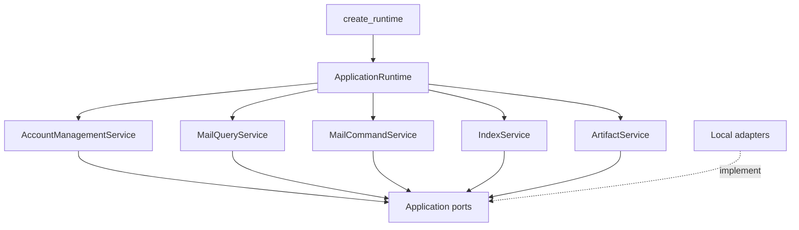
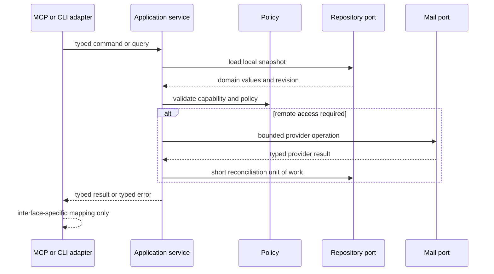

# 02. Application Boundaries

Status: Proposed

Previous: [`01-system-context.md`](01-system-context.md)
Next: [`03-configuration-and-credentials.md`](03-configuration-and-credentials.md)

## Design Principle

The architecture separates user actions from the protocols and storage used to
perform them. FastMCP, Typer, SQLite, keyring, IMAP, SMTP, MIME parsing, and the
filesystem are adapters. Application services own use-case sequencing and
policy. Domain models describe mail concepts without carrying framework types.

This is a focused local architecture, not a generic framework. Ports exist only
where the product already needs multiple behavior implementations, a test seam,
or a strict security boundary.

## Composition Root

A single `create_runtime()` composition root constructs the local application.
It accepts explicit bootstrap settings and an interface profile and returns
interface-ready services.



`create_runtime()` is responsible for:

- resolving the database path and compatibility mode;
- opening and validating SQLite;
- selecting the secret backend explicitly;
- constructing the legacy configuration and environment overlay adapters;
- constructing repository, mail, MIME, clock, and artifact adapters;
- constructing application services with policy and limit values;
- registering shutdown callbacks.

It does not start stdio, parse CLI arguments, register tools, or perform mail
network calls.

## Layers

### Domain

The domain layer owns values and policies that remain meaningful without a
particular transport or database:

- `AccountId`, `AccountName`, and account capability values;
- `MailboxRef`, `MessageId`, and `MessagePlacement`;
- normalized email addresses and recipient roles;
- flags, attachment metadata, freshness, and index coverage values;
- sender, recipient, mutation, and local-path policies;
- operation states and typed domain errors.

Domain models never contain:

- `sqlite3.Row` or SQL column names;
- FastMCP content blocks or tool exceptions;
- IMAP response tuples or SMTP client objects;
- keyring service names or plaintext credentials;
- arbitrary filesystem paths used as storage identifiers.

### Application

The application layer owns commands, queries, transaction intent, policy
enforcement, and typed DTOs.

#### `AccountManagementService`

Used primarily by CLI management commands:

- initialize and inspect managed configuration;
- list account summaries and their source;
- create, update, disable, soft-remove, guarded hard-purge, and test managed
  accounts;
- bind, rotate, migrate, repair, and remove credentials through persisted
  secret-change state;
- preview and import legacy configuration;
- report shadowed environment accounts and unresolved secrets.

#### `MailQueryService`

Used by MCP read tools and optional CLI diagnostics:

- list accounts and account capabilities;
- list mailboxes;
- search indexed message metadata;
- refresh a bounded metadata range when requested;
- read bounded message body sections;
- list attachment metadata;
- report metadata coverage, addition freshness, flag freshness, and
  complete-membership freshness independently.

#### `MailCommandService`

Owns externally visible mutations:

- send a message;
- save a draft or message to a mailbox;
- mark, move, archive, and delete messages;
- revalidate placement identity and mailbox revision at each remote-effect
  boundary;
- require a target-scoped delete primitive or return a non-expunged partial or
  policy rejection; never escalate a scoped command to bare mailbox-wide EXPUNGE;
- reconcile confirmed remote outcomes into SQLite;
- distinguish complete, partial, uncertain, and failed outcomes.

#### `IndexService`

Owns explicit and on-demand metadata maintenance:

- discover additions, flag changes, and membership changes with independent
  freshness evidence;
- upsert metadata and placements;
- apply QRESYNC/VANISHED evidence or complete UID-set membership reconciliation;
- ensure partial observations never infer removal by absence;
- advance metadata and membership cursor evidence transactionally;
- invalidate a mailbox on UIDVALIDITY change;
- fence older refreshes when a placement-scoped operation crosses its effect
  boundary;
- rebuild FTS projections;
- purge expired body cache, orphaned message data, and stale metadata.

#### `ArtifactService`

Owns bounded local materialization:

- validate approved input and output roots;
- stream attachment and export data without arbitrary path traversal;
- create private temporary files;
- return opaque artifact metadata or an approved local path;
- clean up expired temporary artifacts.

### Interfaces

Interfaces map external syntax to application DTOs and map typed results and
errors back to the external contract.

- The MCP adapter registers a stable stdio tool catalog and optional resource or
  prompt enhancements.
- The CLI adapter parses human input, masks secret prompts, renders status and
  diagnostics, and chooses exit codes.

An interface must not instantiate `EmailClient`, access global settings, execute
SQL, or decide sender/recipient policy.

### Adapters

Adapters implement concrete side effects:

- SQLite migrations, repositories, FTS, and unit-of-work behavior;
- current TOML loading and legacy persistence behavior;
- environment runtime overlays;
- OS keyring and explicit plaintext compatibility storage;
- IMAP, SMTP, MIME parsing, mailbox discovery, and provider quirks;
- private filesystem workspace operations;
- process time and ID generation.

## Application Ports

Ports are narrow and use application or domain types.

### Persistence ports

- `AccountIdentityRepository`: stable operational IDs and non-secret source
  mappings for managed, legacy, and environment accounts without copying legacy
  configuration into managed rows.
- `AccountRepository`: managed catalog lifecycle and generation, global/account
  policy, normalized rule sets, non-secret managed account definitions, endpoint
  settings, revisions, and tombstones.
- `CredentialChangeRepository`: active, candidate, and pending-cleanup bindings
  plus persisted secret-change saga states.
- `MailIndexRepository`: stable mailbox identity shells required by operation
  fences plus rebuildable mailbox metadata, messages, placements, addresses, body
  cache, attachments, search projections, and sync cursors.
- `OperationRepository`: durable per-recipient, target, and compound-step
  evidence; target fences that remain enforceable across mail-index compaction;
  fenced pre-effect and remote-effect-possible transitions; explicit unknown
  acknowledgment; and base-mode-independent evidence-capacity accounting for send
  and other mutations.
- `UnitOfWork`: one short SQLite transaction across repositories when an
  application invariant requires atomic local state.

These ports are not a promise to support another database. They isolate SQL
schema details and permit deterministic service tests.

### Configuration and credential ports

- `LegacyConfigReader`: reads the existing stored TOML model without accidental
  environment persistence.
- `RuntimeOverlayProvider`: supplies the process-local environment overlay.
- `SecretStore`: resolves values and creates or deletes independently addressable
  managed secret versions by opaque reference. Candidate identity is reservable
  before the value write. A compatibility backend that can only replace in place
  must expose atomic compare-and-swap plus a durable rollback/version handle
  recoverable by pre-persisted change ID after process loss.

Read-only and mutable secret backends expose different capabilities. Application
code must not call a write method and discover only at runtime that an
environment backend is immutable.

### Mail ports

- `MailGateway`: account-scoped mailbox discovery, metadata fetch, body and
  attachment fetch, flags, move, append, and delete operations.
- `MessageSender`: SMTP submission with per-envelope-recipient accepted,
  rejected, or unknown evidence.
- `MimeCodec`: bounded parsing and message composition.

Splitting SMTP submission from IMAP mailbox operations makes the sent-copy
partial-success boundary explicit.

### Local service ports

- `ArtifactWorkspace`: private, quota-aware stream storage and approved-path
  materialization.
- `Clock`: testable time.
- `IdFactory`: stable account, message, operation, and artifact identifiers.

No `HostIntegration`, daemon lease, tenant repository, or HTTP session port is
part of this design.

## Request and Transaction Boundary

Every external action maps to one application command or query:



Network activity happens before or after, never during, the short local
transaction. Where a remote result and local write cannot be atomic, the
application persists an explicit reconciliation state rather than claiming
transactional behavior across systems.

## Runtime Scope

`ApplicationRuntime` is process-scoped and immutable after construction except
for owned connection/session pools. Managed account and policy data is loaded
through repositories for each operation or a revision-aware cache.

An `OperationContext` is call-scoped and contains only:

- correlation and cancellation state;
- current time budget;
- requested freshness and output limits;
- an immutable account snapshot once resolved.

There is no user principal, tenant, HTTP session, or global mutable `Settings`
object in the application contract.

## Target Package Ownership

```text
mcp_email_server/
  domain/
    accounts.py
    mail.py
    policies.py
    errors.py
  application/
    dto.py
    ports.py
    accounts.py
    mail_queries.py
    mail_commands.py
    indexing.py
    artifacts.py
  adapters/
    sqlite/
      database.py
      migrations.py
      repositories.py
      search.py
    config/
      legacy.py
      environment.py
    secrets/
      keyring.py
      plaintext.py
    mail/
      imap.py
      smtp.py
      mime.py
    artifacts.py
  interfaces/
    mcp.py
    cli.py
  bootstrap.py
```

This is an ownership map, not a requirement to create one file for every name or
to move all code at once. Small modules may be combined when the dependency
rules remain clear.

## Dependency Rules

- Domain imports only standard-library and domain-safe modeling utilities.
- Application imports domain types and port protocols, not adapter modules.
- Interfaces and adapters may depend on application contracts.
- Interfaces never depend directly on one another.
- Repository APIs return domain/application values, not rows or connections.
- Mail adapters return typed provider results, not response strings that an
  application service must parse.
- Secret values are resolved only immediately before constructing a mail client
  and are not attached to long-lived account DTOs returned to interfaces.
- Database transactions never include IMAP, SMTP, keyring, or large filesystem
  operations.
- Logging accepts structured identifiers and error codes, not secret values or
  message content.

## Compatibility Facades

Existing public modules may delegate into the new boundaries while compatibility
is required:

- `mcp_email_server.app` may continue to export `mcp` and current tool callables;
- `mcp_email_server.config` may continue to export current models and functions;
- `mcp_email_server.emails.classic` may continue to export current handlers;
- `mcp_email_server.cli` remains the console entry point.

The currently published `sse`, `streamable-http`, and Gradio `ui` commands are
legacy compatibility entry points. They do not use or expand the proposed local
stdio runtime, and this spec adds no new behavior to them. They remain maintained
against current published behavior until a separately documented, versioned
removal or replacement decision updates code, tests, and user documentation.

A facade may preserve response text or legacy mutation behavior. New
application code must not import back through the facade. Public compatibility
changes require aligned tests and published documentation even though this spec
does not prescribe a release phase plan.

## Testing Boundaries

- Domain policy tests use only values.
- Application service tests use fake ports and assert commands, outcomes, and
  transaction intent.
- SQLite tests use temporary real databases and real migrations.
- Mail adapter tests use deterministic protocol fakes plus the GreenMail E2E
  baseline where applicable.
- MCP tests verify discovery schemas, annotations, text and structured results,
  error mapping, and context bounds.
- CLI tests verify secret masking, source selection, dry runs, exit codes, and
  concurrency-safe writes.
