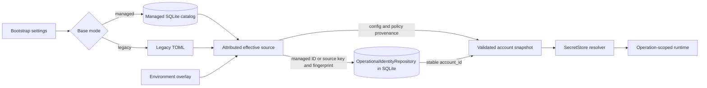
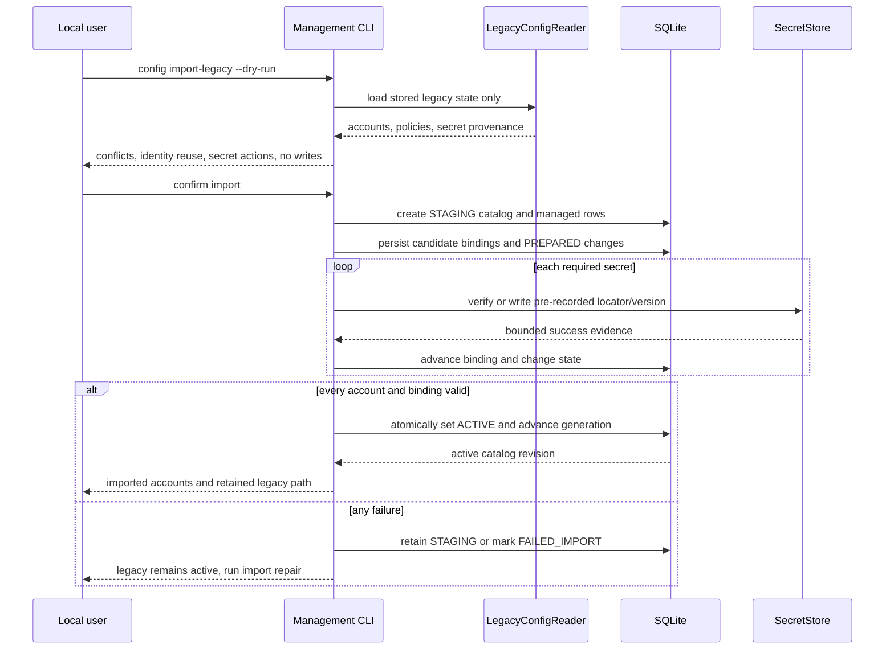

# 03. Configuration and Credentials

Status: Proposed

Previous: [`02-application-boundaries.md`](02-application-boundaries.md)
Next: [`04-mail-workflows-and-consistency.md`](04-mail-workflows-and-consistency.md)

## Purpose

The local Email App needs a managed configuration model without breaking current
TOML, environment-variable, and keyring users. It also needs one unambiguous
source of truth for writable account data and a strict boundary between
non-secret configuration and credentials.

The target supports two explicit base modes:

- **managed mode**: SQLite owns non-secret account and policy configuration;
- **legacy mode**: the existing TOML model remains the base configuration.

Environment values are a read-only runtime overlay in both modes. They never
become a second writable source of truth.

## Bootstrap Settings

A small bootstrap model is resolved before SQLite can be opened. It includes
only values needed to locate and safely initialize the local runtime:

- database path;
- selected base mode, when explicitly configured;
- migration and lock timeouts;
- process-level logging settings;
- emergency read-only or maintenance flags.

The existing `db_location` value and default location remain compatible inputs.
An environment or CLI override may select a different database path. Database
path selection cannot be stored only inside the database it is needed to find.

Bootstrap settings do not contain account passwords or a second copy of the
managed account catalog.

## Configuration Sources



The managed catalog and operational identity repository use the same SQLite file
but are separate logical stores. Managed, legacy, and environment effective
sources all resolve through the identity repository. Only the managed branch
supplies writable account configuration to SQLite.

### Managed SQLite catalog

Managed mode stores a managed account row linked to operational identity,
endpoint settings, enablement, global and account policy, catalog generation,
revisions, and secret bindings in SQLite. It is the only writable base catalog
in that mode. Scalar policy and normalized allowlist or approved-root rules have
explicit schema ownership as defined in
[`05-sqlite-persistence-and-data-model.md`](05-sqlite-persistence-and-data-model.md).

### Legacy TOML

Legacy mode preserves current file location, path migration, model validation,
credential mode, and serialization behavior behind a compatibility adapter. The
adapter distinguishes stored state from the environment-composited effective
view even when a facade must preserve current whole-view writes.

### Environment overlay

Environment values are captured at process startup and applied after the base
catalog. Existing account replacement and setting precedence remain compatible.
Every effective value records its source so CLI diagnostics can show when a
managed or legacy value is shadowed.

Environment-derived accounts and overrides are:

- read-only;
- process-scoped;
- never imported or persisted by an unrelated account update;
- eligible for mail operations after normal validation;
- clearly marked as `environment` source in account summaries.

### Operational identity in every mode

The SQLite operational index uses a local `account_id` independently of the base
configuration source. Legacy and environment accounts create or reuse only an
`ACCOUNT_IDENTITY` plus a non-secret `ACCOUNT_SOURCE` mapping; they do not create
`MANAGED_ACCOUNT`, endpoint, policy, or credential-binding rows. Exact source
key/fingerprint reuse, rename, shadowing, disappearance, and import continuity
are normative in
[`05-sqlite-persistence-and-data-model.md`](05-sqlite-persistence-and-data-model.md).

This separation lets legacy mode persist mail metadata and operation evidence
without copying TOML or environment configuration into a second authoritative
catalog.

## Mode Selection

Mode selection must be deterministic and must not silently import credentials.

1. An explicit CLI or bootstrap setting wins only when its requested base is
   valid; requesting managed mode without an `ACTIVE` catalog is an error.
2. An `ACTIVE` managed catalog selects managed mode; a `MAINTENANCE` catalog
   selects a management-only runtime and never falls back to legacy mail access.
3. If neither active nor maintenance catalog exists and a current or legacy TOML
   file exists, select legacy mode.
4. If only a valid environment account exists, run a legacy-compatible effective
   view without creating managed account rows; operational identity and index
   rows may still be reused.
5. Otherwise, the runtime is unconfigured and the CLI directs the user to
   initialize or import configuration.

The presence of an empty SQLite file, operational identity rows, or a `STAGING`
or `FAILED_IMPORT` catalog does not imply a completed managed import. A managed
catalog stores lifecycle state, catalog generation, policy version, and
revision. `ACTIVE` selects the managed base; `MAINTENANCE` deliberately disables
mail access until another generation transition.

## Explicit Legacy Import

Switching to managed mode is a management action, not an automatic startup side
effect.



Import rules:

- Dry-run is always available and never resolves or prints secret values.
- Import reads stored TOML without environment account injection.
- Account-name conflicts require an explicit resolution; no silent overwrite.
- Existing keyring entries may be referenced without copying their values.
- Before any managed secret write, import persists a `STAGING` catalog, reuses or
  creates the operational identity, inserts the managed account and immutable
  `CANDIDATE` binding, and creates the `PREPARED` change that references it.
- Plaintext legacy credentials move to the selected managed secret backend only
  after explicit confirmation and through the same persisted secret-change saga
  used by managed rotation.
- The legacy file is retained until the user explicitly archives or removes it.
- One final transaction verifies every staged account and binding, changes the
  catalog to `ACTIVE`, and advances generation. No earlier staging write changes
  base-mode selection.
- A failed import leaves legacy mode operational. Its exact candidate locators
  remain repairable from SQLite without backend enumeration; repair may resume or
  clean them and mark the catalog `FAILED_IMPORT`.

After managed mode is active, TOML is not also writable as a base catalog.
Re-import requires a deliberate merge operation with conflict reporting.

### Mode-transition visibility

Activating managed mode increments a durable catalog generation. A stdio process
selects its base mode at startup and does not hot-swap repositories while calls
may be in flight. It compares its startup generation when accepting every mail
operation and again before provider access.

For a mutation, the effect boundary is the linearization point. The SQLite
transition from `CLAIMED_PRE_EFFECT` to `REMOTE_EFFECT_POSSIBLE`, `SUBMITTING`,
or the equivalent compound substep verifies the startup generation in the same
conditional transaction. Catalog activation and that transition therefore have
a deterministic order:

- if activation commits first, the old process receives `RESTART_REQUIRED` and
  performs no new provider side effect;
- if an effect-boundary transition commits first, that provider call may finish
  and reconcile from its already validated snapshot; every later independent or
  compound side-effect substep checks generation again;
- ordinary account and policy revisions within the same mode are visible through
  repository reads on the next operation;
- the MCP client must restart the stdio server to construct the new base adapter;
- read-only diagnostics may report the transition but must not continue using a
  stale writable base.

An operation may use its original snapshot for local validation before the
boundary; “already started” does not grant permission to cross the boundary
after a generation change. This conditional transaction closes the check/call
TOCTOU window for SMTP and IMAP mutations.

The operational SQLite index is available in both legacy and managed modes. Mode
selection chooses the writable base account and policy catalog; it does not turn
the mail index on or off.

## Effective Account Snapshot

For each operation, `EffectiveAccountCatalog` creates an immutable snapshot:

1. resolve the selected effective source to its stable operational `account_id`;
2. load the selected base account and its revision without copying legacy or
   environment configuration into managed rows;
3. load managed global policy and account overrides when applicable;
4. apply compatible environment replacement or per-field setting overrides;
5. validate account capability and the fully attributed effective policy;
6. resolve required secret references only for the requested mail operation;
7. return an operation-scoped account snapshot;
8. discard secret values when the mail client/session is closed.

List and diagnostic operations do not resolve secret values unless they perform
an explicit credential or connectivity check.

## Secret Model

A `SecretRef` identifies a value without containing it:

```text
SecretRef
  backend: keyring | environment | plaintext_legacy
  locator: backend-specific opaque identifier
  purpose: incoming | outgoing | provider
  version: immutable managed rotation version when the backend is mutable
```

The locator is internal and never appears in MCP results. SQLite may store the
backend, opaque locator, purpose, and lifecycle metadata. It must not store the
resolved secret in ordinary columns, JSON, operation payloads, or FTS content.

### Mutable keyring backend

The OS keyring is the default managed backend. Before writing a managed value,
the application generates or reserves a new immutable locator or version and
persists that candidate identity in SQLite; it never overwrites the active
locator in place. A backend that cannot allocate an independent candidate may be
used for managed rotation only if one atomic compare-and-swap API provides a
durable rollback or version handle keyed by the pre-persisted change ID. That
handle must remain recoverable after process loss without backend enumeration; a
receipt returned only to process memory is insufficient. Explicit managed
keyring mode fails closed when those storage guarantees or secure storage are
unavailable.

The current compatibility key format based on `account_name:role` is an in-place
replace model. It remains a legacy adapter contract and cannot be reused as the
managed rotation algorithm without the stronger rollback behavior above.

### Read-only environment backend

An environment binding references a named process variable and supports resolve
only. The CLI reports that rotation and deletion must happen outside the app.
Environment references are useful for ephemeral or externally managed accounts,
but they are not silently converted into persistent keyring values.

### Plaintext legacy backend

Plaintext behavior remains available for compatibility and explicit local use.
It preserves owner-only atomic file writes on supported platforms. It is not the
managed default and never results from an implicit keyring fallback in managed
mode.

The current `auto`, `keyring`, and `plaintext` semantics remain normative while
legacy mode is selected. In particular, current `auto` fallback behavior is a
compatibility contract, not the target default for newly managed accounts.

## Credential Writes

Configuration and secret stores cannot share one transaction. Managed secret
creation, rotation, and import use a persisted saga rather than an unrecorded
best-effort sequence:

1. validate the complete proposed non-secret update;
2. in one transaction guarded by the expected account revision, generate or
   reserve an immutable candidate locator/version, insert its `CANDIDATE`
   binding, and create one `PREPARED` `SECRET_CHANGE` that references both the
   old and candidate binding IDs; only one active change is allowed for an
   account and purpose;
3. outside the SQLite transaction, write the secret to exactly that pre-recorded
   candidate locator/version, then mark the intent `CANDIDATE_WRITTEN`;
4. in one SQLite compare-and-swap transaction, activate the candidate binding,
   increment the account revision, retain the old binding as
   `OLD_DELETE_PENDING`, and mark the change `BINDING_COMMITTED`;
5. mark the change `CLEANUP_PENDING`, then outside the transaction delete the old
   locator;
6. mark or remove the old binding as `DELETED` and mark the change `COMPLETED`;
7. persist bounded error codes and retry state for every incomplete cleanup.

Account removal uses the `DELETE` change variant after the account is durably
disabled. It persists `PREPARED` with the old binding and a null candidate, then
in one revision-checked transaction detaches the active binding, marks it
`OLD_DELETE_PENDING`, and advances the change to `BINDING_COMMITTED`. It then
uses the same `CLEANUP_PENDING -> COMPLETED` cleanup path. Deletion never needs a
candidate and never removes a secret still required by an enabled account.

A failed candidate write leaves the active binding untouched. A crash after the
external write but before `CANDIDATE_WRITTEN` is recoverable because the
`PREPARED` row already identifies the candidate; repair can probe, reconcile, or
delete that exact locator without enumeration. If the binding transaction fails,
only the independent candidate locator may be deleted. A backend that used the
qualified atomic compare-and-swap alternative must recover through its durable,
pre-associated rollback/version handle. Deletion by immutable locator is
idempotent; a not-found result counts as cleaned only after the committed binding
state proves that locator is no longer active. The application must never delete
the locator still referenced by the committed account revision.

`credential repair` scans persisted change and pending-cleanup rows. It does not
assume that a generic keyring backend can enumerate all application entries.
Account removal and legacy import use the same saga. No saga row contains a
resolved secret value.

An update never deletes or overwrites the only known working secret before the
new account revision is durable. Cleanup uncertainty remains repairable and
visible across process crashes.

## Account Revisions and Concurrent CLI Writes

Managed accounts have stable IDs and monotonic revisions. CLI updates include
the revision they inspected. If another process changed the account or has an
active credential change for the same purpose, the update fails with a conflict
and shows the new summary rather than overwriting it.

Renaming an account changes its display name, not its stable ID or secret
binding identity. Environment overlays continue to match the documented
compatibility key; CLI diagnostics must warn when a rename changes shadowing
behavior.

`account remove` first soft-deletes and disables the account. The stable ID and
name remain reserved while secret cleanup or retained operation evidence exists.
A separate hard purge requires completed secret cleanup, no unresolved or
unknown operation, retention eligibility, explicit confirmation, and a warning
that historical idempotency evidence will be lost. It follows the guarded,
explicit account-graph deletion order in
[`05-sqlite-persistence-and-data-model.md`](05-sqlite-persistence-and-data-model.md);
completed child rows do not disappear through an implicit cascade.

## CLI Management Contract

The target CLI management surface includes commands equivalent to:

- `config status`, `config init`, and `config import-legacy --dry-run`;
- `account list`, `account show`, `account add`, `account update`,
  `account disable`, `account remove`, `account hard-purge`, and `account test`;
- `credential status`, `credential set`, `credential migrate`, and
  `credential repair`;
- `index status`, `index sync`, `index rebuild`, `index purge`, and explicit
  operational-identity list/rebind/retire actions for legacy source conflicts;
- `doctor` for database, migration, source identity, secret, filesystem, IMAP,
  and SMTP checks.

Exact command spelling may follow existing Typer conventions, but the ownership
rules are normative:

- secret values are read through masked interactive input or a named external
  source, never echoed;
- secret values should not be accepted as ordinary positional arguments;
- every destructive command supports confirmation and non-interactive explicit
  consent;
- imports, migrations, and destructive maintenance support dry-run where a
  preview is meaningful;
- output identifies whether values are managed, legacy, environment, or
  shadowed without exposing secret locators.

## MCP Configuration Boundary

The target MCP catalog does not accept mailbox credentials or manage account
configuration. `add_email_account` currently exists and is therefore a public
compatibility concern, but it is not part of the target management design.
Keeping it temporarily requires an explicit compatibility decision and the same
security controls; new workflows and documentation must direct account setup to
the CLI.

Mail tools may return an `UNCONFIGURED` or `ACCOUNT_UNAVAILABLE` error with a
safe CLI remediation command. They do not request a password through tool input
or MCP elicitation.

## Compatibility Ledger

Legacy mode preserves, unless a separately documented versioned change says
otherwise:

- current and legacy default TOML path behavior;
- import-time path compatibility where public code depends on it;
- environment account injection and replacement precedence;
- supported environment flags and allowlists;
- `auto`, `keyring`, and `plaintext` behavior;
- keyring sentinel resolution and credential migration semantics;
- current public Pydantic models and imports at compatibility facades;
- current reset cleanup behavior.

Managed mode deliberately improves these behaviors:

- stored and effective values are separate;
- environment values are never persisted accidentally;
- account identity is stable across rename;
- secrets are represented by explicit references;
- new account writes do not silently downgrade from keyring to plaintext.

## Security and Validation

Tests cover:

- deterministic mode selection and database path resolution;
- current and legacy TOML loading;
- every documented environment override and replacement rule, including present
  empty allowlists and durable deny precedence;
- operational identity reuse and conflict behavior for legacy, environment,
  shadowed, renamed, disappeared, and imported accounts, including canonical
  fingerprint versions and upgrades, without managed config duplication;
- managed account and policy revisions, mandatory global rule-set completeness,
  account absence/inherit behavior, rule-set merge semantics, complete source
  attribution, and cross-process conflicts;
- atomic mode-generation/effect-boundary ordering and `RESTART_REQUIRED` before
  each independent provider side effect;
- dry-run, staging lifecycle, failed-import rollback, and candidate repair;
- each secret backend's explicit capabilities;
- keyring failure plus secret-change crashes before and after every saga boundary;
- concurrent rotations proving a failed CAS cannot delete or overwrite the active
  secret;
- pending cleanup, account soft removal, explicit guarded hard-purge ordering,
  orphan reporting limitations, and repair without backend enumeration;
- no secret values in SQLite, logs, MCP results, exception strings, or test
  snapshots;
- atomic owner-only plaintext compatibility writes;
- managed versus legacy reset and backup behavior.

SQLite tables and constraints are defined in
[`05-sqlite-persistence-and-data-model.md`](05-sqlite-persistence-and-data-model.md).
