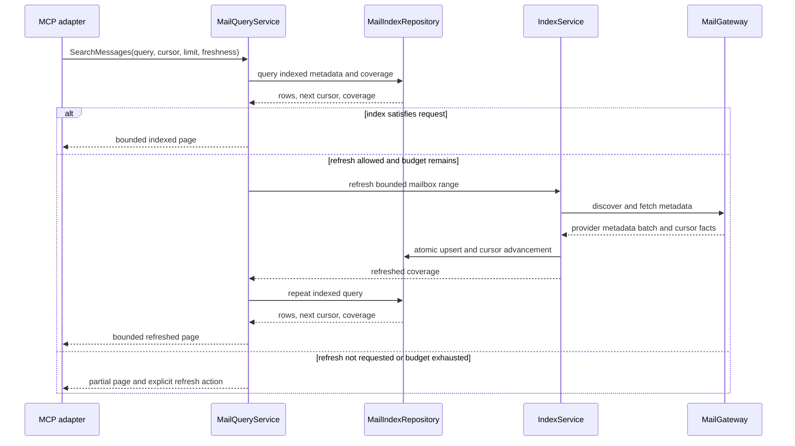
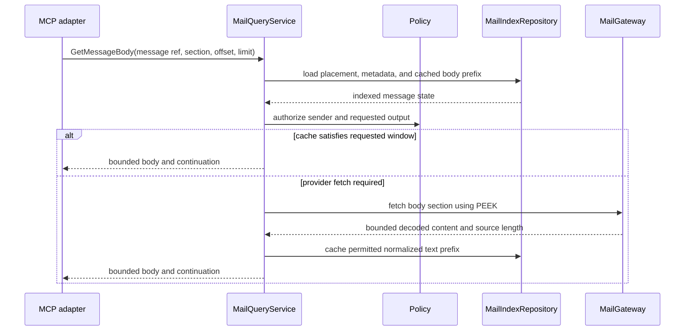
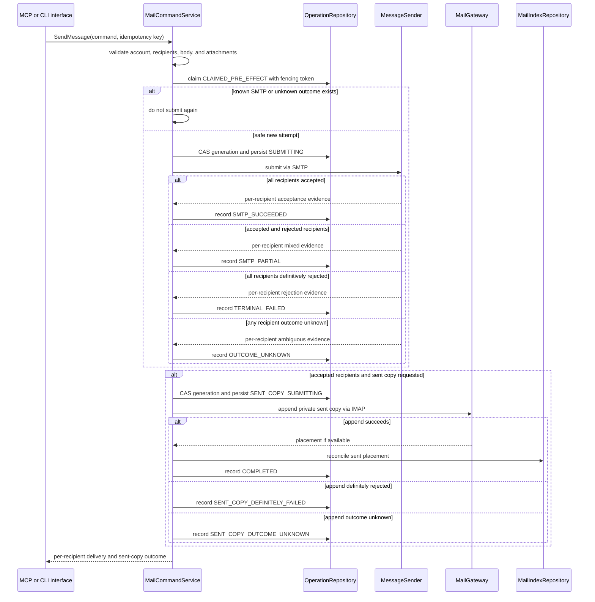
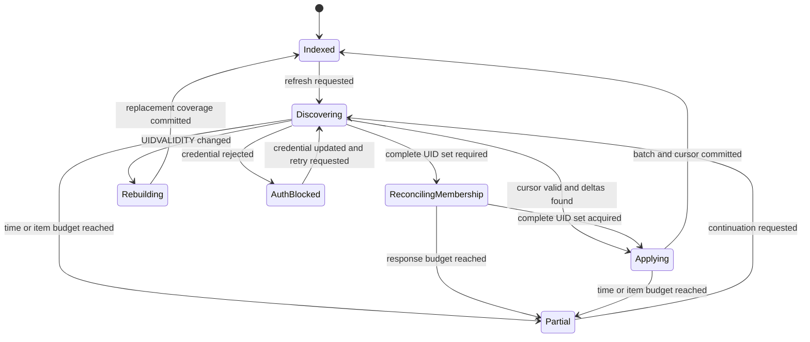
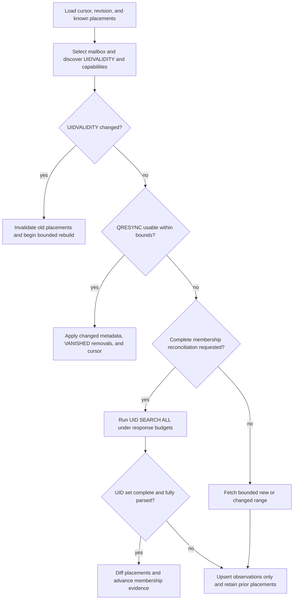

# 04. Mail Workflows and Consistency

Status: Proposed

Previous: [`03-configuration-and-credentials.md`](03-configuration-and-credentials.md)
Next: [`05-sqlite-persistence-and-data-model.md`](05-sqlite-persistence-and-data-model.md)

## Consistency Model

IMAP, SMTP, SQLite, the secret backend, and the local filesystem do not share a
transaction. Application services distinguish remote truth, local indexed
state, confirmed outcomes, and uncertain outcomes instead of presenting them as
one atomic system.

IMAP is authoritative for remote mailbox membership, flags, bodies, and
attachments. An indexed placement proves only that the application observed it
at a stated time; it does not prove that the placement still exists remotely.
SQLite is a rebuildable, freshness-qualified projection for those data classes,
not a competing mailbox source of truth.

SQLite improves performance and recovery, but it does not make provider side
effects exactly once. The application never retries an ambiguous send merely
because a local write failed.

## Command and Query Types

Queries return bounded data and declare freshness and coverage. Commands return
a typed operation outcome and reconcile known remote effects into SQLite.

Every result that depends on indexed state includes:

- `source`: `indexed`, `refreshed`, or `partial`;
- the metadata observation or refresh timestamp;
- relevant mailbox addition-sync, flag-sync, and
  complete-membership-reconciliation timestamps;
- whether the requested metadata range and mailbox membership are fully covered;
- an opaque continuation when more results are available;
- warnings when local reconciliation remains pending.

Interface adapters may preserve current response shapes, but internal services
do not infer success by parsing human-readable strings.

## Message Identity

Every effective managed, legacy, or environment account first resolves to a
stable local operational `account_id`; this does not make its source
configuration managed. An external IMAP UID is meaningful only within that
account, mailbox, and UIDVALIDITY value:

```text
MessagePlacement = account_id + mailbox_id + uidvalidity + uid
```

`mailbox_id` is an opaque local operational identity, not a disposable row ID
while an unreleased operation fence refers to it. Index compaction and full
rebuild retain its identity shell and reuse the same ID when rediscovering the
same canonical remote mailbox. An evidence-backed mailbox rename rebinds the
remote name without changing the ID; uncertain rename continuity blocks provider
effects until explicit reconciliation or rebind rather than silently assigning a
fenced target a new identity.

SQLite assigns an opaque internal `message_id` for local references. RFC 5322
`Message-ID` is searchable metadata, not a unique key: it may be absent,
duplicated, or reused.

Current MCP inputs use mailbox-scoped `email_id` values. A compatibility mapper
resolves those values into a `MessagePlacement`. New internal APIs never pass an
unscoped UID.

## Metadata Search and Refresh

Metadata-first access is the default path.



### Search rules

- The application-level cursor is opaque and tied to account, mailbox set,
  filters, sort order, and an index snapshot boundary.
- `limit` has a conservative default and hard maximum.
- Results use deterministic ordering with a unique tie-breaker.
- Exact totals are optional and returned only when metadata and membership
  coverage are complete within the declared freshness policy, no relevant stale
  placement, stale flag projection, or reconciliation remains, and the query can
  compute them cheaply.
- FTS results identify whether only metadata or also cached body text was
  searched.
- A provider-side search may be used to extend coverage, but its results are
  normalized into the same DTO and labeled as refreshed or partial.
- Sender allowlist filtering occurs before a message is exposed in a result.

The current page-number MCP contract can remain a facade. The application core
uses cursors because pages are unstable while mail arrives or moves.

## Mailbox Discovery

Mailbox discovery refreshes mailbox names, delimiters, attributes, and
UIDVALIDITY. Provider-specific archive and sent-folder detection belongs to the
mail adapter, which returns typed candidates and evidence. Application policy
selects a configured override or a validated candidate.

Mailbox names are untrusted provider data. SQL, logs, MCP output, and IMAP
commands use parameterization or protocol-safe encoding rather than string
interpolation.

## Body Retrieval



Body rules:

- IMAP PEEK is used by default so reading does not mark a message as seen.
- Marking as read is a separate explicit command or an explicit option whose
  partial failure is reported.
- The service accepts one or a bounded number of message references.
- The caller selects a body section or normalized text view, an offset, and a
  maximum size.
- A truncated result returns `has_more` and the next offset or cursor. A textual
  truncation marker is compatibility presentation, not the only continuation
  signal.
- Persistent body cache is a contiguous normalized-text prefix beginning at
  offset zero. Arbitrary later windows are sliced from a complete prefix or
  fetched under byte and decode budgets without being cached as if they were the
  start of the body.
- Blocked sender policy is evaluated from safe metadata before fetching a body
  or attachment whenever possible.
- HTML is treated as untrusted. The MCP baseline returns normalized text; any
  future renderer must sanitize HTML and block remote content separately.
- Body cache policy is explicit. Metadata indexing does not silently enable
  durable full-body storage.

## Attachment Discovery and Materialization

Attachment metadata is discovered before bytes are transferred. It includes an
opaque attachment ID, filename, media type, size when known, content ID, and
message reference.

Materialization then:

1. validates account, sender policy, attachment ID, size, and allowed output
   root;
2. fetches the exact MIME part without loading unrelated payloads when the
   provider and parser permit it;
3. streams through quota and checksum enforcement;
4. atomically publishes to a private temporary file or explicitly approved
   destination;
5. returns bounded metadata and the approved local path;
6. schedules temporary output for cleanup according to policy.

Filenames never determine the storage path directly. Raw attachment bytes are
not stored in SQLite and are not inlined in normal tool results.

## Send and Sent-copy Flow



### Send rules

- All To, CC, and BCC addresses are normalized and checked against recipient
  policy before MIME composition or local file reads.
- The submitted MIME message contains no `Bcc` header. SMTP still receives BCC
  addresses as RCPT TO envelope recipients, and the private sent copy may contain
  BCC metadata, preserving current behavior.
- `MessageSender` returns accepted, definitively rejected, and unknown status for
  every envelope recipient plus bounded provider evidence.
- Mixed acceptance records `SMTP_PARTIAL`. A retry never resubmits to accepted or
  unknown recipients; retrying rejected recipients is an explicit new operation
  with a newly reviewed recipient set.
- SMTP acceptance remains successful for accepted recipients if saving the sent
  copy fails.
- A definitely failed sent copy may be retried as that substep only. An unknown
  APPEND is first reconciled by stable Message-ID and bounded payload evidence;
  it is never immediately appended again.
- The operation persists `SUBMITTING` before entering SMTP code. That conditional
  transaction verifies the attempt token and startup catalog generation; a
  generation mismatch returns `RESTART_REQUIRED` without submission. A stale
  `CLAIMED_PRE_EFFECT` claim may be fenced and safely reclaimed, while a stale
  `SUBMITTING` attempt becomes `OUTCOME_UNKNOWN` and is never automatically
  resent.
- An idempotency key is scoped to account, operation kind, and payload hash. The
  same key with a different payload is rejected.
- Idempotency reduces known replay; it cannot prove that a provider accepted a
  message after a lost response.
- Local attachments are read only from approved roots and are bounded before
  SMTP submission.

## Save, Mark, Move, Archive, and Delete

Mutation sequence:

1. resolve every external reference to a current placement;
2. load safe metadata and enforce sender and mutation policy;
3. validate mailbox capability and command preconditions;
4. record and claim operation intent, atomically reserving required evidence
   capacity before any provider effect when durable resume evidence is useful;
5. conditionally verify claim token and catalog generation while persisting the
   remote-effect-possible substep; for a placement-scoped command, the same
   transaction also verifies the expected placement is `ACTIVE` under the same
   UIDVALIDITY and mailbox cursor revision, proves that no other unresolved
   operation target fence matches the account, mailbox, UIDVALIDITY, and UID, and
   advances the corresponding mailbox revision; a membership-affecting command
   additionally marks each source target `STALE` with the attempt as owner, while
   a flag-only command verifies the flag projection is `CONFIRMED` and marks only
   that projection stale with ownership;
6. perform the remote IMAP command outside SQLite transactions;
7. reconcile confirmed outcomes, conditionally restore a definitely unaffected
   placement, or leave an uncertain placement stale;
8. return per-item success, failure, and uncertainty without claiming an entire
   batch succeeded.

Specific rules:

- Save-to-mailbox works without SMTP and records `APPENDUID` placement when the
  provider returns it.
- Mark-as-read changes only the requested flag and preserves unrelated flags.
- Move uses native MOVE when available and a tested copy/delete fallback
  otherwise.
- The fallback preflights target-scoped source-deletion capability and policy
  before COPY. If the request requires a completed move and policy does not allow
  a source-delete-pending result, it rejects before copying. Otherwise it records
  copy and source-delete as separate substeps. After a known copy success it may
  continue only target-scoped source deletion or reconciliation; it never repeats
  the copy. An unknown copy result is reconciled before any further side effect.
- A placement-scoped delete or move fallback never issues bare mailbox-wide
  `EXPUNGE`. It may use UID EXPUNGE when UIDPLUS is available or another provider
  primitive proven to remove only the approved targets. Without a safe scoped
  primitive, it either leaves only those targets marked `\Deleted` and reports
  `DELETED_NOT_EXPUNGED` or `SOURCE_DELETE_PENDING`, or rejects a requested hard
  delete before that step according to explicit policy.
- Bare `EXPUNGE` is a separately modeled mailbox-wide destructive operation, not
  an implementation detail of a message-ID-scoped command. If any interface
  exposes it, the request and approval surface identify the mailbox-wide scope;
  the target MCP catalog does not implicitly escalate a scoped delete into it.
- A move retains local message identity only when provider evidence or safe
  reconciliation supports it; otherwise the destination is discovered on
  refresh.
- Archive selection comes from adapter discovery plus application policy, not a
  hard-coded MCP folder name.
- Delete semantics remain provider-aware and explicit about `\Deleted`, UID
  EXPUNGE, provider auto-expunge, and the absence of safe hard-delete support.
- A membership-affecting effect boundary marks each source target stale with the
  attempt as owner before provider access. Confirmed delete or source removal
  then removes the placement; definitive no-effect failure may restore it only
  while the
  attempt token and stale ownership marker match and no newer contradictory
  provider evidence exists. An ambiguous result preserves ownership for
  operation-aware reconciliation and never treats replay as a safe way to
  discover the outcome.
- A flag-only mutation still revalidates the placement and advances the mailbox
  revision at its effect boundary, but it does not mark mailbox membership stale,
  hide the message, or purge its body cache. It requires a `CONFIRMED` flag
  projection and marks that projection stale with attempt ownership before
  provider access. The provider command changes only the requested flags and
  preserves unrelated flags. The projection returns to `CONFIRMED` only from a
  canonical complete resulting flag set explicitly returned by the provider or a
  complete follow-up FETCH observed after the mutation interval. A delta response
  or prior cached flags plus the requested delta is insufficient because another
  client may concurrently change an unrelated flag. Known remote success without
  that complete observation leaves the flag projection stale and requires
  reconciliation. Definitive no-effect may restore the prior confirmed projection
  under the ownership checks, and unknown outcome leaves flags stale.
- A stale flag projection remains visible as uncertainty on the message, but its
  last known `flags_json` is not a definitive match for flag-dependent filters,
  sorting, or exact counts. Such queries return partial or
  reconciliation-pending state until a provider observation confirms the flags;
  flag-independent metadata queries may still return the message.
- Privacy-preserving blocked mutation behavior remains compatible: blocked IDs
  appear missing or as no-op success unless reporting is explicitly enabled.

## On-demand Synchronization

No background daemon is required. Synchronization runs through a bounded MCP
query refresh or an explicit CLI command.



- Remote fetch happens before the short write transaction.
- The metadata batch and corresponding cursor advancement commit atomically.
- Cursor advancement uses a revision check so two local processes cannot move a
  cursor past data they did not persist.
- Duplicate concurrent fetches are safe because mailbox and placement upserts
  are idempotent.
- UIDVALIDITY change invalidates old UID mappings and starts a controlled rebuild
  without deleting unrelated account data.
- Time, item, and byte budgets produce an honest `partial` state and continuation.
- Authentication failures stop refresh for that invocation and remain visible
  until credentials change; no hot loop exists.

## Remote Disappearance and Expunge Reconciliation

Discovering additions and proving removals are different operations. `UIDNEXT`
and the highest observed UID can discover likely additions, but they cannot show
that an older UID was expunged. A message-count comparison is also insufficient:
one deletion and one arrival can leave the count unchanged.



The normative rules are:

- When QRESYNC is supported and the adapter can encode the known UID state within
  protocol and application bounds, matching-UIDVALIDITY `VANISHED` data is
  authoritative removal evidence. CONDSTORE or a changed message count alone is
  not removal evidence.
- Otherwise, removal by absence requires one successful, completely parsed
  mailbox UID-set reconciliation, such as bounded `UID SEARCH ALL`, under the
  same UIDVALIDITY. A timeout, truncated response, parse failure, cancellation,
  or item/byte budget exhaustion makes the membership result incomplete.
- A bounded metadata or recent-UID refresh may add or update placements but must
  never remove a placement merely because that placement was not observed.
- Metadata coverage and membership reconciliation are independent. A complete
  UID set can prove membership while headers remain partially indexed; a recent
  metadata refresh does not refresh the complete-membership timestamp.
- Confirmed provider evidence from this application's own target-scoped UID
  EXPUNGE, MOVE, or equivalent operation may remove the affected source placement
  immediately. Bare mailbox-wide `EXPUNGE` is never used to complete a scoped
  operation because it can remove unrelated messages already carrying
  `\Deleted`.
  An uncertain provider result leaves the operation-owned placement stale until
  operation-aware reconciliation resolves it. Ordinary sync does not clear that
  ownership while the attempt may still be in flight or unknown; authoritative
  existence or removal evidence it observes is persisted for the owning
  operation rather than discarded.
- Provider observations from separate connections are not ordered merely by
  local response-completion time. Evidence whose observation interval overlaps a
  remote-effect interval cannot restore or remove an owned stale placement by
  itself; conflicting evidence requires a new post-attempt observation.
- Remote disappearance removes a mailbox placement, not necessarily the logical
  message. External moves, label changes, and another surviving mailbox
  placement may leave the message remotely available. A destination placement
  is discovered normally and is coalesced only with provider evidence or a
  conservative reconciliation rule, never by RFC `Message-ID` alone.
- Confirmed-removed and stale placements are excluded from ordinary indexed
  search as soon as their state is known. A query scope containing unresolved
  stale placements reports partial or reconciliation-pending state and does not
  return an exact total even after a complete UID-set observation. When no
  confirmed placement remains,
  cached body text and its FTS projection are purged by default; any minimum
  metadata needed for bounded operation reconciliation is not user-visible.
- A body or attachment request whose provider lookup proves the indexed
  placement is gone reconciles it and returns `STALE_MESSAGE_REFERENCE` or
  `MESSAGE_NOT_FOUND`, not empty content. For a mutation, the remote-effect
  transition atomically rechecks the expected `ACTIVE` placement, UIDVALIDITY,
  and mailbox cursor revision and advances that revision before provider access.
  A membership-affecting transition also marks each source target stale with
  attempt ownership; a mismatch produces a stale-reference outcome without a
  provider call.
- A cache-satisfied read may return data observed within the declared freshness
  policy and reports that age. A caller that requires current remote existence
  requests fresh validation before cached content is served.
- With no daemon, external removal detection is eventually consistent. The app
  does not claim immediate awareness of changes made by another mail client.

The persistence evidence, atomic diff, and cleanup rules are owned by
[`05-sqlite-persistence-and-data-model.md`](05-sqlite-persistence-and-data-model.md).

## Operation States

The minimum durable vocabulary is:

- `PENDING`: validated locally, no remote attempt claimed;
- `CLAIMED_PRE_EFFECT`: one fenced attempt owns work but has not crossed the
  persisted remote-effect boundary;
- `REMOTE_EFFECT_POSSIBLE`: the boundary was persisted before entering provider
  code; a stale attempt becomes unknown rather than being replayed;
- `SUBMITTING`: SMTP-specific remote-effect-possible phase;
- `SMTP_SUCCEEDED`: all envelope recipients were accepted;
- `SMTP_PARTIAL`: accepted and definitively rejected recipients are both recorded;
- `REMOTE_SUCCEEDED`: a non-SMTP remote mutation confirmed;
- `SENT_COPY_SUBMITTING`: sent-copy APPEND may now have an external effect;
- `SENT_COPY_DEFINITELY_FAILED`: APPEND was definitively rejected and may be
  retried as a substep;
- `SENT_COPY_OUTCOME_UNKNOWN`: APPEND may have succeeded and must be reconciled
  before retry;
- `OUTCOME_UNKNOWN`: another remote side effect may have occurred but cannot be
  proven;
- `ACKNOWLEDGED_UNKNOWN`: the user explicitly accepted that the historical remote
  outcome remains unknown; this is not success or failure and never permits
  automatic replay;
- `RECONCILIATION_REQUIRED`: remote success is known and local projection needs
  repair;
- `COMPLETED`: required remote and local steps are reconciled;
- `RETRYABLE_FAILED`: no ambiguous external effect and a bounded retry is safe;
- `TERMINAL_FAILED`: validation, policy, or permanent provider failure.

Each attempt has a random owner token and conditional state transitions. A
placement target fence becomes active in the effect-boundary transaction and
remains active while the provider call is in flight, its outcome is unknown, a
compound substep is pending, or a known remote effect still requires local
reconciliation. Definite no-effect, completed reconciliation, or eligible
explicit unknown acknowledgment releases it; ordinary retention and sync do not.
The pre-effect-to-effect transition is also the mode-generation linearization
point:
it checks the startup generation in the same SQLite transaction. A
placement-scoped transition additionally compares the expected mailbox cursor
revision, confirms that every target placement is still `ACTIVE` under the same
UIDVALIDITY, rejects a match in another unresolved operation's durable target
fence, and advances the mailbox revision. This fence is checked in the same
transaction and remains enforceable even when rebuildable placement metadata has
been compacted. A membership-affecting transition also marks source targets
`STALE` with attempt ownership. A flag-only transition
requires the current flag projection to be `CONFIRMED`, then marks it stale with
attempt ownership while leaving membership active. This serializes competing
effects and fences older refreshes without hiding a message for a flag-only
change. Ordinary sync may update unrelated projections but cannot clear an
operation-owned membership or flag stale marker while that attempt is active or
unknown; relevant provider evidence is handed to the owning operation for
reconciliation. If compaction removed the physical placement, rediscovery of an
identity covered by an unresolved target fence reconstructs the applicable
operation-owned membership or flag uncertainty instead of inserting an ordinary
fully active projection. Only operation-aware reconciliation or explicit
acknowledgment releases that fence. A mismatch returns a stale-reference or
reconciliation outcome without entering provider code. If a catalog transition
committed first, it
returns `RESTART_REQUIRED`; if the attempt transition committed first, that
provider call may finish with its original snapshot. Every later compound-operation
side-effect substep performs its own generation and relevant-placement check. A
stale pre-effect claim can be fenced and reclaimed. Claim expiry after
`REMOTE_EFFECT_POSSIBLE`, `SUBMITTING`, or `SENT_COPY_SUBMITTING` never proves
that no external effect occurred and therefore transitions to the corresponding
unknown state.

The database schema and uniqueness rules are defined in
[`05-sqlite-persistence-and-data-model.md`](05-sqlite-persistence-and-data-model.md).

## Cancellation and Retry

- Every provider call has a timeout and propagates cancellation.
- Cancellation after a confirmed remote result still attempts to persist minimal
  outcome evidence before returning.
- Automatic retry is limited to operations known not to have produced the
  external effect, or to an explicitly resumable later step.
- A stale pre-effect claim can be retried after fencing its old token. A stale
  remote-effect-possible claim cannot.
- Partial SMTP acceptance and unknown recipient or sent-copy outcomes require
  reconciliation or a separately reviewed new operation, not payload replay.
- Backoff is bounded and applies within one explicit operation; there is no
  background retry scheduler.
- Authentication, policy, and operation-evidence-capacity failures are not
  retried automatically; capacity failure occurs before the remote-effect
  boundary and directs the user to reconciliation or acknowledgment.
- A database-busy error after remote success yields reconciliation-required, not
  a repeated remote mutation.
- Explicit acknowledgment records unresolved history as `ACKNOWLEDGED_UNKNOWN`,
  releases operation-owned projection markers through the persistence rules, and
  never converts uncertainty into permission to replay the original effect.

## Validation

Tests cover successful and failure boundaries for:

- indexed, refreshed, and partial metadata results;
- cursor stability, concurrent refresh, UIDVALIDITY rebuild, and successful empty
  or no-change addition/flag checks advancing only their applicable freshness;
- QRESYNC/VANISHED removal, complete UID-set fallback, and proof that partial,
  interrupted, or budget-exhausted refreshes never infer deletion by absence;
- a scoped delete or move fallback with an unrelated pre-existing `\Deleted` UID,
  proving bare EXPUNGE is never issued and the unrelated UID survives;
- confirmed scoped expunge, no-safe-expunge partial outcome, hard-move rejection
  before COPY, ambiguous deletion, overlapping sync/effect evidence, external
  move, stale references, stale-placement suppression of exact totals despite
  complete membership, and
  orphaned body/FTS cleanup;
- unknown STORE outcome followed by flag-independent search, flag-dependent
  filtering, and exact-count calculation;
- mark-as-read racing another client's unrelated flag change, proving that a
  delta or cached-flags-plus-delta result remains stale until a complete
  post-mutation flag set is observed;
- unresolved membership mutation followed by projection compaction or full index
  rebuild, provider rediscovery, and a competing mutation, proving the mailbox ID
  remains bound, rediscovery remains operation-owned stale, and the durable target
  fence rejects the competing effect before provider access;
- PEEK body reads, bounded windows, and cache policy;
- attachment size, path, and sender-policy controls;
- SMTP full, partial, rejected, and per-recipient unknown outcomes;
- crashes before and after the persisted SMTP boundary, fenced stale claims, and
  proof that post-boundary recovery never automatically resends;
- definite and unknown sent-copy outcomes plus reconciliation before APPEND
  retry;
- BCC MIME-header versus SMTP-envelope handling and idempotency payload mismatch;
- per-item mutation outcomes, copy/delete fallback substeps, and local
  reconciliation failure;
- cancellation before and after remote side effects;
- compatibility behavior exercised by the GreenMail stdio baseline.
