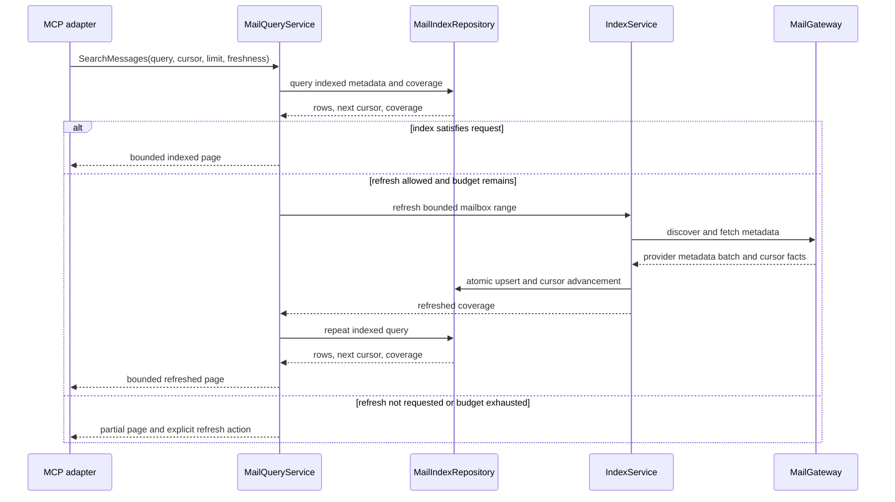
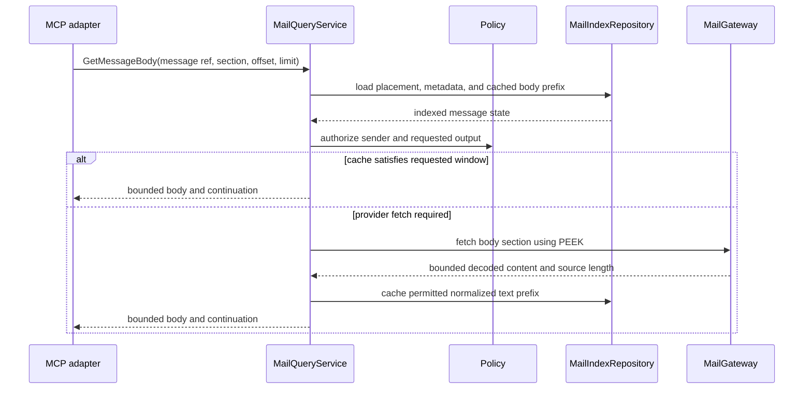
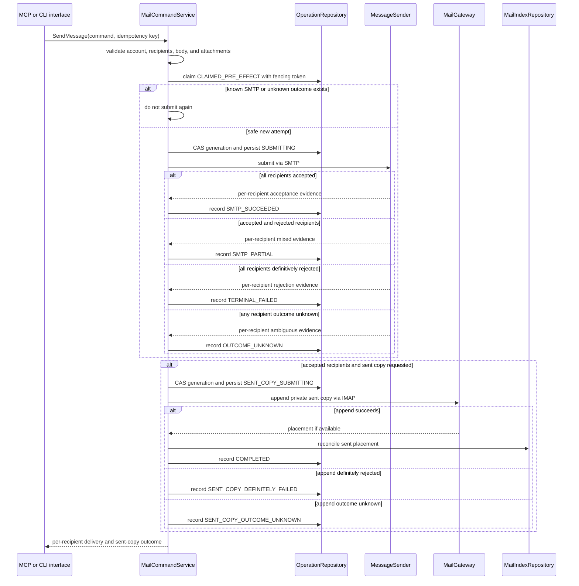
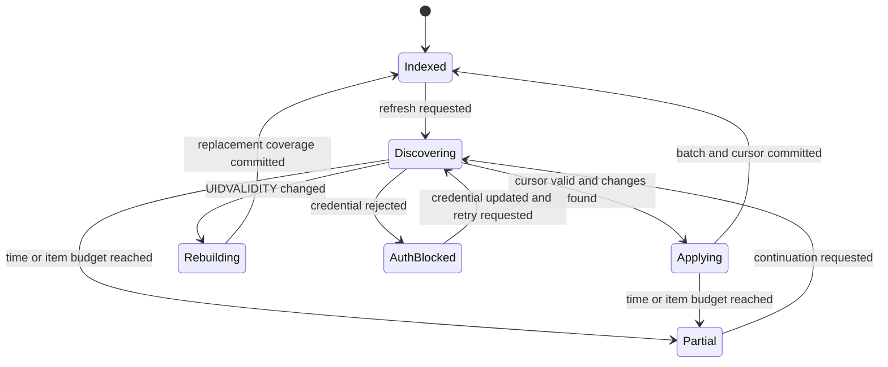

# 04. Mail Workflows and Consistency

Status: Proposed

Previous: [`03-configuration-and-credentials.md`](03-configuration-and-credentials.md)
Next: [`05-sqlite-persistence-and-data-model.md`](05-sqlite-persistence-and-data-model.md)

## Consistency Model

IMAP, SMTP, SQLite, the secret backend, and the local filesystem do not share a
transaction. Application services distinguish remote truth, local indexed
state, confirmed outcomes, and uncertain outcomes instead of presenting them as
one atomic system.

SQLite improves performance and recovery, but it does not make provider side
effects exactly once. The application never retries an ambiguous send merely
because a local write failed.

## Command and Query Types

Queries return bounded data and declare freshness and coverage. Commands return
a typed operation outcome and reconcile known remote effects into SQLite.

Every result that depends on indexed state includes:

- `source`: `indexed`, `refreshed`, or `partial`;
- the index or refresh timestamp;
- whether the requested range is fully covered;
- an opaque continuation when more results are available;
- warnings when local reconciliation remains pending.

Interface adapters may preserve current response shapes, but internal services
do not infer success by parsing human-readable strings.

## Message Identity

Every effective managed, legacy, or environment account first resolves to a
stable local operational `account_id`; this does not make its source
configuration managed. An external IMAP UID is meaningful only within that
account, mailbox, and UIDVALIDITY value:

```text
MessagePlacement = account_id + mailbox_id + uidvalidity + uid
```

SQLite assigns an opaque internal `message_id` for local references. RFC 5322
`Message-ID` is searchable metadata, not a unique key: it may be absent,
duplicated, or reused.

Current MCP inputs use mailbox-scoped `email_id` values. A compatibility mapper
resolves those values into a `MessagePlacement`. New internal APIs never pass an
unscoped UID.

## Metadata Search and Refresh

Metadata-first access is the default path.



### Search rules

- The application-level cursor is opaque and tied to account, mailbox set,
  filters, sort order, and an index snapshot boundary.
- `limit` has a conservative default and hard maximum.
- Results use deterministic ordering with a unique tie-breaker.
- Exact totals are optional and returned only when the index has complete
  coverage and the query can compute them cheaply.
- FTS results identify whether only metadata or also cached body text was
  searched.
- A provider-side search may be used to extend coverage, but its results are
  normalized into the same DTO and labeled as refreshed or partial.
- Sender allowlist filtering occurs before a message is exposed in a result.

The current page-number MCP contract can remain a facade. The application core
uses cursors because pages are unstable while mail arrives or moves.

## Mailbox Discovery

Mailbox discovery refreshes mailbox names, delimiters, attributes, and
UIDVALIDITY. Provider-specific archive and sent-folder detection belongs to the
mail adapter, which returns typed candidates and evidence. Application policy
selects a configured override or a validated candidate.

Mailbox names are untrusted provider data. SQL, logs, MCP output, and IMAP
commands use parameterization or protocol-safe encoding rather than string
interpolation.

## Body Retrieval



Body rules:

- IMAP PEEK is used by default so reading does not mark a message as seen.
- Marking as read is a separate explicit command or an explicit option whose
  partial failure is reported.
- The service accepts one or a bounded number of message references.
- The caller selects a body section or normalized text view, an offset, and a
  maximum size.
- A truncated result returns `has_more` and the next offset or cursor. A textual
  truncation marker is compatibility presentation, not the only continuation
  signal.
- Persistent body cache is a contiguous normalized-text prefix beginning at
  offset zero. Arbitrary later windows are sliced from a complete prefix or
  fetched under byte and decode budgets without being cached as if they were the
  start of the body.
- Blocked sender policy is evaluated from safe metadata before fetching a body
  or attachment whenever possible.
- HTML is treated as untrusted. The MCP baseline returns normalized text; any
  future renderer must sanitize HTML and block remote content separately.
- Body cache policy is explicit. Metadata indexing does not silently enable
  durable full-body storage.

## Attachment Discovery and Materialization

Attachment metadata is discovered before bytes are transferred. It includes an
opaque attachment ID, filename, media type, size when known, content ID, and
message reference.

Materialization then:

1. validates account, sender policy, attachment ID, size, and allowed output
   root;
2. fetches the exact MIME part without loading unrelated payloads when the
   provider and parser permit it;
3. streams through quota and checksum enforcement;
4. atomically publishes to a private temporary file or explicitly approved
   destination;
5. returns bounded metadata and the approved local path;
6. schedules temporary output for cleanup according to policy.

Filenames never determine the storage path directly. Raw attachment bytes are
not stored in SQLite and are not inlined in normal tool results.

## Send and Sent-copy Flow



### Send rules

- All To, CC, and BCC addresses are normalized and checked against recipient
  policy before MIME composition or local file reads.
- The submitted MIME message contains no `Bcc` header. SMTP still receives BCC
  addresses as RCPT TO envelope recipients, and the private sent copy may contain
  BCC metadata, preserving current behavior.
- `MessageSender` returns accepted, definitively rejected, and unknown status for
  every envelope recipient plus bounded provider evidence.
- Mixed acceptance records `SMTP_PARTIAL`. A retry never resubmits to accepted or
  unknown recipients; retrying rejected recipients is an explicit new operation
  with a newly reviewed recipient set.
- SMTP acceptance remains successful for accepted recipients if saving the sent
  copy fails.
- A definitely failed sent copy may be retried as that substep only. An unknown
  APPEND is first reconciled by stable Message-ID and bounded payload evidence;
  it is never immediately appended again.
- The operation persists `SUBMITTING` before entering SMTP code. That conditional
  transaction verifies the attempt token and startup catalog generation; a
  generation mismatch returns `RESTART_REQUIRED` without submission. A stale
  `CLAIMED_PRE_EFFECT` claim may be fenced and safely reclaimed, while a stale
  `SUBMITTING` attempt becomes `OUTCOME_UNKNOWN` and is never automatically
  resent.
- An idempotency key is scoped to account, operation kind, and payload hash. The
  same key with a different payload is rejected.
- Idempotency reduces known replay; it cannot prove that a provider accepted a
  message after a lost response.
- Local attachments are read only from approved roots and are bounded before
  SMTP submission.

## Save, Mark, Move, Archive, and Delete

Mutation sequence:

1. resolve every external reference to a current placement;
2. load safe metadata and enforce sender and mutation policy;
3. validate mailbox capability and command preconditions;
4. record and claim operation intent when durable resume evidence is useful;
5. conditionally verify claim token and catalog generation while persisting the
   remote-effect-possible substep;
6. perform the remote IMAP command outside SQLite transactions;
7. persist confirmed outcomes or mark the affected local state stale;
8. return per-item success, failure, and uncertainty without claiming an entire
   batch succeeded.

Specific rules:

- Save-to-mailbox works without SMTP and records `APPENDUID` placement when the
  provider returns it.
- Mark-as-read changes only the requested flag and preserves unrelated flags.
- Move uses native MOVE when available and a tested copy/delete fallback
  otherwise.
- The fallback records copy and source-delete as separate substeps. After a known
  copy success it may continue only deletion or reconciliation; it never repeats
  the copy. An unknown copy result is reconciled before any further side effect.
- A move retains local message identity only when provider evidence or safe
  reconciliation supports it; otherwise the destination is discovered on
  refresh.
- Archive selection comes from adapter discovery plus application policy, not a
  hard-coded MCP folder name.
- Delete semantics remain provider-aware and explicit about expunge behavior.
- Privacy-preserving blocked mutation behavior remains compatible: blocked IDs
  appear missing or as no-op success unless reporting is explicitly enabled.

## On-demand Synchronization

No background daemon is required. Synchronization runs through a bounded MCP
query refresh or an explicit CLI command.



- Remote fetch happens before the short write transaction.
- The metadata batch and corresponding cursor advancement commit atomically.
- Cursor advancement uses a revision check so two local processes cannot move a
  cursor past data they did not persist.
- Duplicate concurrent fetches are safe because mailbox and placement upserts
  are idempotent.
- UIDVALIDITY change invalidates old UID mappings and starts a controlled rebuild
  without deleting unrelated account data.
- Time, item, and byte budgets produce an honest `partial` state and continuation.
- Authentication failures stop refresh for that invocation and remain visible
  until credentials change; no hot loop exists.

## Operation States

The minimum durable vocabulary is:

- `PENDING`: validated locally, no remote attempt claimed;
- `CLAIMED_PRE_EFFECT`: one fenced attempt owns work but has not crossed the
  persisted remote-effect boundary;
- `REMOTE_EFFECT_POSSIBLE`: the boundary was persisted before entering provider
  code; a stale attempt becomes unknown rather than being replayed;
- `SUBMITTING`: SMTP-specific remote-effect-possible phase;
- `SMTP_SUCCEEDED`: all envelope recipients were accepted;
- `SMTP_PARTIAL`: accepted and definitively rejected recipients are both recorded;
- `REMOTE_SUCCEEDED`: a non-SMTP remote mutation confirmed;
- `SENT_COPY_SUBMITTING`: sent-copy APPEND may now have an external effect;
- `SENT_COPY_DEFINITELY_FAILED`: APPEND was definitively rejected and may be
  retried as a substep;
- `SENT_COPY_OUTCOME_UNKNOWN`: APPEND may have succeeded and must be reconciled
  before retry;
- `OUTCOME_UNKNOWN`: another remote side effect may have occurred but cannot be
  proven;
- `RECONCILIATION_REQUIRED`: remote success is known and local projection needs
  repair;
- `COMPLETED`: required remote and local steps are reconciled;
- `RETRYABLE_FAILED`: no ambiguous external effect and a bounded retry is safe;
- `TERMINAL_FAILED`: validation, policy, or permanent provider failure.

Each attempt has a random owner token and conditional state transitions. The
pre-effect-to-effect transition is also the mode-generation linearization point:
it checks the startup generation in the same SQLite transaction. If a catalog
transition committed first, it returns `RESTART_REQUIRED`; if the attempt
transition committed first, that provider call may finish with its original
snapshot. Every later compound-operation side-effect substep performs its own
generation-checked transition. A stale pre-effect claim can be fenced and
reclaimed. Claim expiry after `REMOTE_EFFECT_POSSIBLE`, `SUBMITTING`, or
`SENT_COPY_SUBMITTING` never proves
that no external effect occurred and therefore transitions to the corresponding
unknown state.

The database schema and uniqueness rules are defined in
[`05-sqlite-persistence-and-data-model.md`](05-sqlite-persistence-and-data-model.md).

## Cancellation and Retry

- Every provider call has a timeout and propagates cancellation.
- Cancellation after a confirmed remote result still attempts to persist minimal
  outcome evidence before returning.
- Automatic retry is limited to operations known not to have produced the
  external effect, or to an explicitly resumable later step.
- A stale pre-effect claim can be retried after fencing its old token. A stale
  remote-effect-possible claim cannot.
- Partial SMTP acceptance and unknown recipient or sent-copy outcomes require
  reconciliation or a separately reviewed new operation, not payload replay.
- Backoff is bounded and applies within one explicit operation; there is no
  background retry scheduler.
- Authentication and policy failures are not retried automatically.
- A database-busy error after remote success yields reconciliation-required, not
  a repeated remote mutation.

## Validation

Tests cover successful and failure boundaries for:

- indexed, refreshed, and partial metadata results;
- cursor stability, concurrent refresh, and UIDVALIDITY rebuild;
- PEEK body reads, bounded windows, and cache policy;
- attachment size, path, and sender-policy controls;
- SMTP full, partial, rejected, and per-recipient unknown outcomes;
- crashes before and after the persisted SMTP boundary, fenced stale claims, and
  proof that post-boundary recovery never automatically resends;
- definite and unknown sent-copy outcomes plus reconciliation before APPEND
  retry;
- BCC MIME-header versus SMTP-envelope handling and idempotency payload mismatch;
- per-item mutation outcomes, copy/delete fallback substeps, and local
  reconciliation failure;
- cancellation before and after remote side effects;
- compatibility behavior exercised by the GreenMail stdio baseline.
