# 05. SQLite Persistence and Data Model

Status: Proposed

Previous: [`04-mail-workflows-and-consistency.md`](04-mail-workflows-and-consistency.md)
Next: [`06-mcp-interface-and-client-compatibility.md`](06-mcp-interface-and-client-compatibility.md)

## Purpose

SQLite is the local Email App's managed store. It provides durable non-secret
configuration, fast metadata search, cross-process reuse, synchronization
cursors, and operation evidence without introducing a server database.

SQLite is not authoritative for remote mailbox contents and is not a secret
vault. The schema distinguishes durable local configuration and operation
evidence from rebuildable mail indexes and caches.

## Storage Classes

| Class                         | Examples                                                 | Rebuildable                                 | Default persistence                                   |
| ----------------------------- | -------------------------------------------------------- | ------------------------------------------- | ----------------------------------------------------- |
| Managed configuration         | Accounts, endpoints, policies, secret bindings           | No                                          | Yes                                                   |
| Operational identity          | Stable IDs and legacy/environment source mappings        | No, when evidence refers to it              | Yes in every base mode                                |
| Operation evidence            | SMTP acceptance, uncertain outcome, reconciliation state | No                                          | Yes; unresolved is capacity-bounded with backpressure |
| Mail index                    | Mailbox identity/metadata, messages, placements, flags   | Yes, except a fenced mailbox identity shell | Yes                                                   |
| Search projection             | FTS subject, addresses, preview, permitted cached text   | Yes                                         | Yes when available                                    |
| Body cache                    | Normalized plain-text prefixes                           | Yes                                         | Bounded and policy-controlled                         |
| Attachment metadata           | Filename, MIME type, part locator, size                  | Yes                                         | Yes                                                   |
| Raw MIME and attachment bytes | Provider payloads                                        | Yes                                         | No by default                                         |
| Temporary artifacts           | Explicit local materialization                           | Yes                                         | Private filesystem with expiry                        |

## Sources of Truth

- Managed account configuration is authoritative in SQLite only after an
  `ACTIVE` managed catalog has been explicitly initialized.
- `ACCOUNT_IDENTITY` and `ACCOUNT_SOURCE` are authoritative only for local
  operational continuity; they never override legacy or environment base
  configuration.
- The selected `SecretStore` is authoritative for secret values. SQLite stores
  `SecretRef` metadata only.
- IMAP is authoritative for remote mailboxes, placements, flags, bodies, and
  attachments. An index row is a timestamped observation, not proof of current
  remote existence.
- SMTP response evidence is authoritative for known delivery acceptance.
- SQLite operation records are authoritative for what the local application
  observed and which reconciliation steps remain.

## Logical Schema

```mermaid
erDiagram
    ACCOUNT_IDENTITY ||--o{ ACCOUNT_SOURCE : resolves
    ACCOUNT_IDENTITY ||--o| MANAGED_ACCOUNT : configures
    MANAGED_CATALOG ||--|| GLOBAL_POLICY : governs
    MANAGED_CATALOG ||--o{ MANAGED_ACCOUNT : owns
    MANAGED_CATALOG ||--o{ POLICY_RULE_SET : defines
    MANAGED_ACCOUNT ||--|| ACCOUNT_POLICY : overrides
    MANAGED_ACCOUNT o|--o{ POLICY_RULE_SET : scopes
    POLICY_RULE_SET ||--o{ POLICY_RULE : contains
    MANAGED_ACCOUNT ||--o{ MAIL_ENDPOINT : configures
    MANAGED_ACCOUNT ||--o{ CREDENTIAL_BINDING : references
    MANAGED_ACCOUNT ||--o{ SECRET_CHANGE : changes
    ACCOUNT_IDENTITY ||--o{ MAILBOX : owns
    ACCOUNT_IDENTITY ||--o{ MESSAGE : indexes
    ACCOUNT_IDENTITY ||--o{ OPERATION : records
    MAILBOX ||--o{ MESSAGE_PLACEMENT : contains
    MESSAGE ||--o{ MESSAGE_PLACEMENT : placed_as
    OPERATION_ATTEMPT o|--o{ MESSAGE_PLACEMENT : fences
    MESSAGE ||--o{ MESSAGE_ADDRESS : addresses
    MESSAGE ||--o{ MESSAGE_BODY : caches
    MESSAGE ||--o{ ATTACHMENT : describes
    MAILBOX ||--o| SYNC_CURSOR : tracks
    OPERATION ||--o{ OPERATION_ATTEMPT : attempts

    ACCOUNT_IDENTITY {
        text id PK
        text display_name
        text state
        datetime first_seen_at
        datetime last_seen_at
        datetime retired_at
    }
    ACCOUNT_SOURCE {
        text id PK
        text account_id FK
        text source_kind
        text source_namespace
        text source_key
        integer fingerprint_version
        text source_fingerprint
        text state
        datetime first_seen_at
        datetime last_seen_at
    }
    MANAGED_CATALOG {
        text id PK
        text lifecycle_state
        integer generation
        integer revision
        integer policy_version
        datetime updated_at
    }
    GLOBAL_POLICY {
        text catalog_id PK, FK
        integer revision
        text default_secret_backend
        text metadata_index_scope
        integer report_blocked_mutations
        integer attachment_download_enabled
        integer metadata_quota_bytes
        integer body_cache_quota_bytes
        integer operation_evidence_quota_bytes
        integer unresolved_operation_limit
        integer artifact_quota_bytes
    }
    MANAGED_ACCOUNT {
        text account_id PK, FK
        text catalog_id FK
        text account_name UK
        text full_name
        text email_address
        text status
        integer revision
        datetime deleted_at
        datetime created_at
        datetime updated_at
    }
    ACCOUNT_POLICY {
        text account_id PK, FK
        integer revision
        text freshness_policy
        text mutation_policy
        integer body_cache_enabled
        datetime updated_at
    }
    POLICY_RULE_SET {
        text id PK
        text catalog_id FK
        text account_id FK
        text kind
        text mode
        integer revision
    }
    POLICY_RULE {
        text id PK
        text rule_set_id FK
        text normalized_value
        text effect
        integer ordinal
        integer enabled
    }
    MAIL_ENDPOINT {
        text id PK
        text account_id FK
        text role
        text host
        integer port
        text tls_mode
        integer verify_tls
        text username
    }
    CREDENTIAL_BINDING {
        text id PK
        text account_id FK
        text purpose
        text backend
        text locator
        text version
        text state
        datetime created_at
        datetime updated_at
    }
    SECRET_CHANGE {
        text id PK
        text account_id FK
        text purpose
        text kind
        integer expected_account_revision
        text old_binding_id FK
        text candidate_binding_id FK
        text state
        text error_code
        datetime created_at
        datetime updated_at
    }
    MAILBOX {
        text id PK
        text account_id FK
        text remote_name
        text delimiter
        text attributes_json
        integer uidvalidity
        integer uidnext
        datetime indexed_at
    }
    MESSAGE {
        text id PK
        text account_id FK
        text rfc_message_id
        text subject
        datetime sent_at
        datetime internal_date
        integer size_bytes
        text preview
        datetime last_observed_at
    }
    MESSAGE_PLACEMENT {
        text mailbox_id FK
        text message_id FK
        integer uidvalidity
        integer uid
        text membership_state
        text flags_json
        text flags_state
        integer modseq
        datetime flags_confirmed_at
        datetime flags_stale_at
        text flags_stale_attempt_id FK
        datetime last_confirmed_at
        datetime stale_at
        text stale_reason
        text stale_attempt_id FK
    }
    MESSAGE_ADDRESS {
        text message_id FK
        text role
        integer ordinal
        text display_name
        text address
    }
    MESSAGE_BODY {
        text message_id FK
        text body_kind
        text content_prefix
        integer source_chars
        integer prefix_chars
        text completeness
        datetime cached_at
        datetime expires_at
    }
    ATTACHMENT {
        text id PK
        text message_id FK
        text part_locator
        integer ordinal
        text filename
        text media_type
        text content_id
        integer size_bytes
        text checksum
    }
    SYNC_CURSOR {
        text mailbox_id PK
        integer uidvalidity
        integer highest_uid
        integer highest_modseq
        text metadata_coverage_state
        datetime metadata_coverage_start
        text membership_coverage_state
        datetime last_addition_sync_at
        datetime last_flag_sync_at
        datetime last_complete_membership_at
        integer revision
        datetime updated_at
    }
    OPERATION {
        text id PK
        text account_id FK
        text kind
        text idempotency_key
        text payload_hash
        text state
        text target_json
        text result_json
        datetime created_at
        datetime updated_at
    }
    OPERATION_ATTEMPT {
        text id PK
        text operation_id FK
        integer attempt_number
        text claim_token
        text phase
        datetime claim_deadline
        datetime remote_started_at
        text outcome
        text error_code
        datetime started_at
        datetime finished_at
    }
```



This is a logical schema. Physical migrations may combine narrowly related
tables or add generated columns when measured query behavior justifies it. They
must preserve identity, secret, and transaction invariants.

## Operational Account Identity

`ACCOUNT_IDENTITY.id` is the stable local `account_id` used by mailboxes,
messages, cursors, and operations in every base mode. It contains no endpoint,
policy, or secret configuration and therefore does not make the database a
second account-config source in legacy mode. Its `display_name` is diagnostic
metadata and is never used instead of effective-source resolution. Operational
identity rows and mail index rows may exist when no managed catalog is active.
Identity state is `ACTIVE` while any selected source or managed account can use
it and `RETIRED` when only retained index or evidence refers to it; retirement
does not itself delete evidence.

`ACCOUNT_SOURCE` maps a non-managed source to that identity. A source mapping is
unique on `(source_kind, source_namespace, source_key)`:

- for legacy TOML, the namespace is a stable local digest of the logical
  configuration source and the key is the stored account entry key. The current
  and legacy default paths are recognized aliases; an explicit custom-path move
  transfers or rebinds the namespace rather than silently creating identities;
- for the environment account, the namespace identifies the documented
  environment slot and the key is its compatibility account name;
- `source_fingerprint` is a versioned digest of the exact non-secret identity
  tuple defined below; it detects accidental source-key reuse without storing a
  copy of source configuration.

For a legacy source, `source_namespace` is encoded as
`legacy-path-v1:<sha256>`. The recognized current and legacy default paths map to
the same logical input before hashing. A custom path expands the user directory,
becomes absolute, resolves existing symlinks, normalizes separators and the
platform's filesystem case semantics, and then uses a length-prefixed UTF-8 path
encoding. If the target does not yet exist, the existing parent is resolved and
the final component retained. `source_key` is the validated stored account key
after trim and Unicode NFC normalization with case preserved; the environment
slot uses the same account-name rule. Moving a custom source or retargeting a
symlink therefore requires the explicit namespace transfer/rebind already
defined above.

Fingerprint version 1 for an email account is the SHA-256 digest of a
domain-separated, length-prefixed UTF-8 encoding of:

```text
("email-v1", normalized_email_address, incoming_host, incoming_port,
 incoming_username, incoming_tls_mode)
```

Canonicalization is normative:

- email uses the current compatibility address parser, surrounding whitespace
  removal, and lowercase normalization;
- host is trimmed, converted to a lowercase IDNA A-label, and has one terminal
  DNS dot removed;
- port is the validated integer encoded in base-10 without leading zeroes;
- username is trimmed and Unicode NFC-normalized but remains case-sensitive;
- TLS is the normalized `implicit | starttls | none` enum.

Account/display name, full name, password, secret locator, outgoing endpoint,
and mutable policy are excluded. Changing an included field is
identity-affecting and enters the explicit rebind-or-successor conflict flow;
changing an excluded field does not. Another provider kind must define its own
versioned stable principal/endpoint tuple before it may persist operational
identity.

`fingerprint_version` is stored beside the digest. An algorithm upgrade supports
the old and new versions during migration, re-reads the authoritative source,
and compare-and-swaps to the new digest only when the old digest, source key, and
identity mapping all match uniquely. An absent source remains on the old version;
an ambiguous or unverifiable source remains conflicted. Upgrade code never
infers equivalence from display name and never persists the canonical tuple or a
secret in SQLite.

An exact source key, fingerprint version, and digest reuses the identity after
restart. If a key reappears with a materially different fingerprint, the adapter
marks a conflict
and requires an explicit CLI rebind or successor identity; it never silently
attaches old mail or operation evidence. Before creating a new identity, it also
checks for the same fingerprint under another key in that source namespace. Such
a probable out-of-band rename is a conflict and blocks provider-effect operations
until the user chooses rebind or explicitly accepts a successor identity and the
associated idempotency-evidence discontinuity.

A source that disappears updates `last_seen_at` and is retired only through
explicit index maintenance. A CLI-managed legacy rename updates the source
mapping with the file change; an out-of-band rename follows the conflict flow
above rather than silently becoming a new account.

An environment account that shadows the same display name as a managed or legacy
account keeps a distinct source mapping and identity. Name resolution selects the
attributed effective source, not whichever identity was seen first. Diagnostics
show both the selected and shadowed identities.

`MANAGED_ACCOUNT.account_id` is both its primary key and a foreign key to
`ACCOUNT_IDENTITY`. New managed accounts create both rows. A legacy-to-managed
import reuses the selected legacy identity for its staging managed row whenever
the source match is unambiguous, preserving index and operation continuity; the
legacy source mapping remains as provenance and is not a writable managed
configuration row.

## Managed Configuration

### Catalog lifecycle

`MANAGED_CATALOG.lifecycle_state` is one of `STAGING`, `ACTIVE`, `MAINTENANCE`,
or `FAILED_IMPORT`. `ACTIVE` selects managed base mode; `MAINTENANCE` selects a
management-only runtime and must not fall back to legacy mail access. Staging and
failed imports may coexist with an operational legacy index but are never visible
as the effective account catalog. At most one catalog is active or in maintenance
and at most one unfinished staging import exists.

`generation` changes when a process must rebuild its base configuration adapter;
`revision` changes for ordinary writes within one active catalog. Legacy mode
with neither an active nor maintenance catalog uses generation zero. Activating a
staging catalog or entering or leaving maintenance advances generation in the
same transaction that changes lifecycle state.

For a mutation, the transition from `CLAIMED_PRE_EFFECT` to
`REMOTE_EFFECT_POSSIBLE` or `SUBMITTING` conditionally verifies the process's
startup generation in that same SQLite transaction. If it changed, the
transition fails with `RESTART_REQUIRED` and no provider side effect occurs. A
provider call that crossed its boundary before the generation transition may
finish and reconcile from its original snapshot; every later independent or
compound side-effect substep checks generation again.

### Scalar and rule policy

`GLOBAL_POLICY` owns typed scalar settings, including blocked-mutation reporting,
attachment enablement, and cache or artifact quotas. Its operation-evidence quota
and unresolved-operation limit are managed-mode operating thresholds, not the
sole safety limit. Base-mode-independent hard byte and unresolved-count ceilings
are resolved from documented built-in and bootstrap settings before SQLite opens.
Managed policy may tighten those ceilings; legacy TOML may supply lower operating
thresholds; an environment override may only tighten the result. A configured
value above its parent ceiling is invalid and reported with source attribution;
it is not silently clipped or treated as permission to widen capacity. The
effective admission limit in every mode is the minimum applicable valid value and
can never be unbounded or exceed the bootstrap ceiling. `ACCOUNT_POLICY` owns
typed per-account overrides such as freshness, mutation, and body-cache policy.
For ordinary scalar
fields, an explicitly set account value replaces the global value, and a
supported process environment override replaces that result using current
compatibility semantics. Capacity limits are the narrowing-only exception. Every
effective scalar carries its final source.

`POLICY_RULE_SET` makes absence, inheritance, unrestricted access, and an
explicit empty restriction distinguishable. Each global or account scope has at
most one set per `kind`; its `mode` is:

- `INHERIT`: this scope adds no allow constraint;
- `UNRESTRICTED`: explicitly no allow constraint at this scope;
- `RESTRICT`: every request must match an enabled `allow` rule in this scope; a
  restrictive set with zero allow rows denies all.

Absence has scope-specific, non-ambiguous semantics:

- every `ACTIVE` catalog must materialize exactly one global set for every
  supported security-sensitive kind; a missing global set is invalid
  configuration, never implicit unrestricted access;
- catalog activation and startup validation fail if a required global set is
  missing, duplicated, has an unknown mode, or uses global `INHERIT`;
- while invalid, mail/provider operations, indexed content exposure, and
  filesystem materialization that depend on policy are disabled; read-only
  `doctor` may identify the missing set and maintenance CLI may repair it;
- an account-scoped row may be absent, which is implicit `INHERIT`; an explicit
  account `INHERIT` row has the same authorization result but preserves a
  revisioned user choice for diagnostics.

Managed catalog initialization materializes these versioned defaults:

| Global kind            | Initial mode and rules                                               |
| ---------------------- | -------------------------------------------------------------------- |
| `recipient_address`    | `UNRESTRICTED`, preserving the current empty-recipient-list behavior |
| `sender_pattern`       | `UNRESTRICTED`, preserving the current empty-sender-list behavior    |
| `approved_input_root`  | `RESTRICT` to the canonical private import/workspace root            |
| `approved_output_root` | `RESTRICT` to the canonical private artifact workspace               |

A staging catalog may be incomplete while it is built, but the final activation
transaction validates the full required set and its canonical root values.
Migrations that introduce a kind materialize its declared default before the
catalog can remain `ACTIVE`. Database damage or an unknown future kind fails
closed rather than being interpreted as `INHERIT` or `UNRESTRICTED`.

`POLICY_RULE` owns the normalized values and `allow` or `deny` effect. Enabled
deny rules from all durable scopes are unioned and always win. Account allow
rules cannot override a global deny. When both global and account sets are
`RESTRICT`, a request must satisfy both sets, so an account can narrow but cannot
expand global authority.

The initial rule kinds have these complete semantics:

| Rule kind              | Normalized match                                           | Global/account behavior                                              | Environment behavior                                                                                                                                |
| ---------------------- | ---------------------------------------------------------- | -------------------------------------------------------------------- | --------------------------------------------------------------------------------------------------------------------------------------------------- |
| `recipient_address`    | Exact normalized envelope address                          | Every restrictive scope must match; any matching deny wins           | Present `MCP_EMAIL_SERVER_ALLOWED_RECIPIENTS` replaces durable allow constraints; an empty value means unrestricted, while durable denies still win |
| `sender_pattern`       | One normalized sender against an anchored case-folded glob | Every restrictive scope must match; malformed/multiple sender fails  | Present `MCP_EMAIL_SERVER_ALLOWED_SENDERS` replaces durable allow constraints; an empty value means unrestricted, while durable denies still win    |
| `approved_input_root`  | Canonical target is contained by the canonical root        | Every restrictive scope must contain the target; denied subtree wins | No compatibility override; an environment value cannot implicitly add a root                                                                        |
| `approved_output_root` | Canonical target is contained by the canonical root        | Every restrictive scope must contain the target; denied subtree wins | No compatibility override; an environment value cannot implicitly add a root                                                                        |

The two documented allowlist variables intentionally remain process-global,
full process-local replacements for every effective account, including their
existing present-but-empty behavior. This explicit local environment authority
can expand a managed allow constraint, so account summaries and `doctor` report
the replacement and its source. It still cannot override a durable deny rule.
Legacy TOML empty allowlists map to
`UNRESTRICTED`; managed callers use `INHERIT`, `UNRESTRICTED`, or an empty
`RESTRICT` set explicitly rather than overloading one empty list.

Rule evaluation never uses first-match wins. `ordinal` preserves deterministic
CLI display and diagnostics only. An authorization result attributes every
restrictive set, matching deny, and environment replacement that participated;
it does not report only one nominal winner. Unsupported kinds, effects, or
wildcard grammars fail validation, and a new security-sensitive rule kind cannot
ship until this table defines its merge and environment behavior.

Rule-set and scalar policy writes use expected revisions just like account
writes. Unique and check constraints prevent duplicate normalized values and
unsupported effects. A catch-all JSON settings blob must not bypass validation,
revisions, source attribution, or migrations.

### Accounts and removal

`MANAGED_ACCOUNT.account_id` is an application-generated stable identifier shared
with its operational identity. `account_name` is a unique user-facing name, not
the primary identity. Rename increments `revision` and does not re-key messages,
operations, source mappings, or secret bindings.

`account remove` is a soft-delete workflow:

1. change status to `REMOVED` and set `deleted_at` using the expected revision;
2. reject new mail operations while retaining the stable ID and minimum
   non-secret identity;
3. purge rebuildable mailbox, message, body, attachment, and FTS rows separately;
4. complete credential cleanup through the persisted secret-change saga;
5. retain the managed tombstone and operational identity with unresolved or
   retained operation evidence.

`account_name` is not reusable while the tombstone remains. A separate
destructive hard purge runs only after explicit confirmation of the backup and
evidence-loss warning. In one guarded transaction it:

1. rechecks the expected tombstone revision and exclusive maintenance lock;
2. proves that no active or incomplete secret change, live credential binding,
   unresolved/unknown operation, or non-retention-eligible evidence remains;
3. explicitly deletes retention-eligible completed operation attempts and
   operations;
4. deletes completed secret-change and deleted-binding metadata after external
   secret cleanup is proven;
5. deletes rebuildable index rows, account rule sets and rules, policy,
   endpoints, and the managed account row in dependency order;
6. retires or deletes source mappings as requested and deletes the operational
   identity only when no reference remains;
7. releases the unique name only with the tombstone deletion.

Every reference is `RESTRICT` by default. The command uses enumerated deletes and
must not enable a blind cascade over the account graph.

### Endpoints

`MAIL_ENDPOINT.role` is constrained to supported roles such as `incoming` and
`outgoing`. `(account_id, role)` is unique. TLS behavior is represented as a
validated enum such as `implicit`, `starttls`, or `none`; contradictory booleans
are normalized at the adapter boundary.

### Credential bindings and change recovery

`CREDENTIAL_BINDING` contains no resolved value. Its lifecycle is
`CANDIDATE -> ACTIVE -> OLD_DELETE_PENDING -> DELETED`. A partial unique index
permits exactly one `ACTIVE` row for `(account_id, purpose)` while retaining the
independent candidate and cleanup rows. Before the external value write, managed
mutable backends allocate a unique locator/version and the application persists
the `CANDIDATE` binding; the active locator is never modified in place.

`SECRET_CHANGE` persists kind, expected account revision, old and candidate
binding IDs, state, and bounded error code. `SET`, `ROTATE`, and `IMPORT` use
`PREPARED -> CANDIDATE_WRITTEN -> BINDING_COMMITTED -> CLEANUP_PENDING -> COMPLETED`.
`DELETE` has a null candidate and, only after the account is durably disabled,
uses `PREPARED -> BINDING_COMMITTED -> CLEANUP_PENDING -> COMPLETED` while the old
binding advances to `OLD_DELETE_PENDING`. A partial unique index permits only one
incomplete change per account and purpose. Candidate creation, binding
activation, old-secret deletion, account removal, and legacy import all use this
record for crash recovery. Binding and change states are separate vocabularies;
`OLD_DELETE_PENDING` is never a `SECRET_CHANGE` state.

The `locator` is sensitive operational metadata even though it is not the secret
value; it is never exposed through MCP or normal CLI listing. `credential
repair` operates from binding/change rows and does not require keyring
enumeration. Secret deletion by immutable locator is idempotent; not-found is
accepted only when the committed binding state proves the locator is no longer
active. A database constraint cannot prove that an external value exists, so
`doctor` and account tests resolve bindings safely without logging values.

### Core constraints and delete behavior

- `ACCOUNT_SOURCE` is unique on `(source_kind, source_namespace, source_key)`;
  fingerprint version or digest mismatch follows the verified migration or
  conflict path, never an upsert onto old evidence.
- `MANAGED_ACCOUNT.account_name` remains unique across active and retained
  tombstone rows.
- Operational `MAILBOX`, `MESSAGE`, and `OPERATION` rows reference
  `ACCOUNT_IDENTITY`, never `MANAGED_CATALOG`.
- `MAIL_ENDPOINT` is unique on `(account_id, role)`.
- `ACCOUNT_POLICY` is one-to-one with managed account; global and account policy
  revisions advance independently.
- `POLICY_RULE_SET` is unique on `(catalog_id, account_id, kind)`, with null-safe
  uniqueness for global scope. A composite constraint ensures an account-scoped
  set references a managed account in the same catalog. `POLICY_RULE` is unique
  on `(rule_set_id, normalized_value, effect)` and has a deterministic ordinal.
- Exactly one active credential binding and one incomplete secret change may
  exist per managed account and purpose.
- Account removal does not cascade to operation evidence, credential cleanup,
  operational identity, or the managed tombstone.
- Rebuildable mailbox metadata, message, placement, body, attachment, and FTS rows
  may be purged by explicit index cleanup after soft removal. A `MAILBOX` identity
  shell and its local ID cannot be purged or re-keyed while an unreleased
  operation target fence refers to it.
- Placement membership state is constrained to `ACTIVE` or `STALE`; `ACTIVE`
  requires a non-null `last_confirmed_at` and null membership-stale fields, while
  `STALE` requires non-null `stale_at` and `stale_reason`. An operation-owned
  stale row also requires the owning `stale_attempt_id`. Confirmed disappearance
  uses explicit removal rather than a user-visible deleted-mail row.
- Flag projection state is independently constrained to `CONFIRMED` or `STALE`;
  `CONFIRMED` requires non-null `flags_confirmed_at`, non-null canonical
  `flags_json` containing the complete provider-observed flag set, and null
  flag-stale fields. `STALE` requires non-null `flags_stale_at`; an
  operation-owned stale flag projection also requires
  `flags_stale_attempt_id`. The last known `flags_json` may remain stored but is
  not authoritative while flags are stale. A requested delta, or prior cached
  set plus that delta, cannot satisfy the `CONFIRMED` constraint.
- `COMPLETE` membership coverage requires a non-null
  `last_complete_membership_at`. A later incomplete observation or continuity
  gap downgrades coverage without erasing the timestamp of the last successful
  complete reconciliation.
- Every account-graph foreign key uses `RESTRICT` unless a narrow rebuildable
  child relation documents otherwise. Hard purge follows the enumerated guarded
  deletion order and never relies on a blind cascade.

## Mail Index

### Mailboxes and placements

A mailbox is unique on `(account_id, remote_name)`. Its `id` is an opaque local
operational identity. Full index rebuild may clear its attributes, cursor, and
placements, but it retains an identity shell and ID while an unreleased operation
target fence refers to that ID. Rediscovery of the same canonical remote name
reuses the shell. A rename backed by provider identity evidence updates
`remote_name` without changing `id`; when continuity cannot be proven, the
adapter records a mailbox-identity conflict and blocks affected provider effects
until operation reconciliation, acknowledgment, or explicit rebind. It never
silently attaches a fenced ID to a merely similar mailbox.

A placement is unique on:

```text
(mailbox_id, uidvalidity, uid)
```

`MESSAGE_PLACEMENT` also has an index on `(message_id, mailbox_id)`. Its
`membership_state` is `ACTIVE` or `STALE`. `ACTIVE` means the provider last
confirmed the placement at
`last_confirmed_at`; it does not claim that no later remote change occurred.
`STALE` means an ambiguous operation or provider result requires reconciliation,
and `stale_at` records when that uncertainty began. Stale placements are excluded
from ordinary indexed results and cannot authorize a mutation.

Confirmed disappearance physically removes the placement in the same short
transaction that updates the applicable mailbox cursor state. A durable
placement tombstone is unnecessary because a UID is not reused within one
UIDVALIDITY namespace; operation evidence that must survive owns its own bounded
identifiers. Every placement-scoped provider-effect transition conditionally
verifies its expected `ACTIVE` placement, UIDVALIDITY, and mailbox cursor revision,
checks that no other unresolved operation has a matching durable target fence,
and advances the affected mailbox revision in the same transaction that crosses
the effect boundary. The fence match uses account, mailbox, UIDVALIDITY, and UID
from schema-validated `target_json`, so it remains enforceable after rebuildable
placement metadata is compacted. A membership-affecting transition additionally
marks each source target `STALE` with the attempt as owner before provider access,
without pretending one mutation was a complete membership scan. This serializes
competing membership effects and prevents an older refresh from committing and
resurrecting pre-effect state.

A flag-only transition does not change placement membership state or trigger
orphan cache cleanup. It requires `flags_state = CONFIRMED`, then marks it
`STALE` with `flags_stale_attempt_id` before provider access. The provider command
changes only the requested flags. Confirmed remote success returns the projection
to `CONFIRMED` only when the response explicitly contains the canonical complete
resulting flag set or a complete follow-up FETCH observes it after the mutation
interval. A STORE delta or prior `flags_json` plus the requested delta is not a
complete observation and leaves the projection stale for reconciliation, because
a concurrent client may have changed unrelated flags. A definitive no-effect
result may conditionally restore the prior confirmed projection; unknown outcome
leaves the flags operation-owned and stale. Flag-independent queries may retain
the placement, but flag-dependent filters, sorting, and exact totals treat the
projection as unresolved and expose bounded reconciliation warnings.

A normal sync may observe an operation-owned stale membership or flag projection
but does not resolve it while its attempt may still be in flight or unknown. It
may reconcile unrelated projections and advance the mailbox revision.
Authoritative existence, removal, or flag evidence for an owned projection is
persisted as bounded reconciliation evidence on the owning operation rather than
discarded. Confirmed provider success removes or updates the owned projection. A
definitive no-effect result may restore its prior confirmed state only with a
conditional write that verifies the attempt token, ownership marker, and absence
of newer contradictory provider evidence; it does not require an unchanged
mailbox revision and therefore tolerates unrelated synchronization. Unknown
outcome keeps the ownership marker until an operation-aware reconciliation
resolves it. If quota maintenance compacted the placement itself, ordinary sync
must consult unresolved target fences before applying rediscovery. A matching
rediscovered identity reconstructs the applicable membership or flag projection
as operation-owned `STALE`, linked to the retained attempt, rather than creating
an ordinary fully active and confirmed target. Only operation-aware
reconciliation or explicit acknowledgment releases the durable fence; ordinary
sync cannot do so.

Reconciliation evidence records its bounded provider-observation interval. Local
response-completion order across separate connections is not a remote
linearization order. Evidence overlapping the attempt's effect interval cannot
resolve ownership by itself; conflicting evidence requires a new post-attempt
observation.

When UIDVALIDITY changes, all placements in the old namespace become invalid and
are replaced through controlled rebuild. They are never matched to new UIDs by
UID alone. Old rows are excluded immediately and may be deleted as the rebuild
commits; unrelated mailboxes are unaffected.

Removal by absence is legal only for a complete provider UID set under matching
UIDVALIDITY. QRESYNC `VANISHED` evidence and confirmed local provider operations
may remove specifically identified placements. A partial, interrupted, bounded,
or failed scan performs upserts only. These behavior rules are defined in
[`04-mail-workflows-and-consistency.md`](04-mail-workflows-and-consistency.md).

### Messages

`MESSAGE.id` is local and opaque. `rfc_message_id` is nullable and indexed but
not unique. Message coalescing across mailboxes must use provider evidence or a
conservative reconciliation rule; matching only the RFC header is insufficient.
A placement disappearing from one mailbox does not prove that the logical
message was globally deleted or identify a destination placement.

When a message has no `ACTIVE` membership placement, it is excluded from ordinary
search. A stale flag projection alone does not hide it. If only stale membership
placements remain, its cached body and body-derived FTS content are
purged by default while reconciliation proceeds. When no placement remains, its
addresses, attachment metadata, remaining FTS rows, and message row are deleted
unless bounded unresolved operation evidence independently retains the minimum
facts it needs. The target defines no implicit local deleted-mail archive.

Useful indexes include:

- `(account_id, internal_date, id)` for stable recent-mail ordering;
- `(account_id, rfc_message_id)` for thread and sent-copy reconciliation;
- `(account_id, subject)` only if query plans justify it;
- placement indexes for mailbox and UID lookup.

### Addresses

Addresses are normalized into `MESSAGE_ADDRESS` so sender and recipient filters,
allowlists, and search do not depend on parsing JSON at query time.

- `role` is constrained to `from`, `sender`, `reply_to`, `to`, `cc`, or `bcc` as
  appropriate to indexed data.
- `(message_id, role, ordinal)` is unique.
- normalized `address` is indexed with `role` for common filters.
- BCC for received remote messages is stored only when it is legitimately
  present; it is not inferred.

### Body cache

`MESSAGE_BODY` stores decoded, normalized text only under explicit cache policy.
Raw MIME and binary payloads are excluded. `(message_id, body_kind)` is unique.

The cached text is always a contiguous prefix beginning at normalized character
offset zero. `prefix_chars` is the exclusive prefix end. `completeness`
distinguishes `prefix`, `complete`, and `truncated_by_policy`, and
`source_chars` records full normalized length when known. A non-prefix body
request may be served from a complete cached prefix; otherwise it is fetched
without being persisted as a misleading standalone window.

MCP character offsets are applied after bounded MIME decoding. Mail adapters use
provider byte ranges only when they can map them safely through transfer and
character encodings; otherwise they enforce an input-byte budget while decoding
and return `partial` rather than reading an unbounded MIME part.

Body cache may be disabled, limited to recent messages, or capped by bytes and
age. Metadata indexing remains useful when body cache is disabled.

### Attachments

`ATTACHMENT` stores only metadata and a provider-relative MIME part locator.
`(message_id, part_locator)` and `(message_id, ordinal)` are unique where the
provider data supports those constraints. Filenames are display metadata, not
storage keys.

## Full-text Search

When SQLite FTS5 is available, a derived `message_fts` projection indexes only
policy-approved fields:

- subject;
- normalized sender and recipient addresses;
- preview;
- cached normalized body text when body indexing is enabled.

The FTS row references `MESSAGE.id`. Repository transactions update the content
row and search projection together or mark the projection stale for repair.
FTS content is rebuildable from base index rows.

FTS5 availability is checked at startup. If unavailable, the app remains
functional with indexed filters and provider search; it reports reduced search
capability rather than failing the entire runtime.

A search response states whether body text was in the indexed field set. It does
not imply full-message search when only metadata coverage exists.

## Synchronization Cursors

`SYNC_CURSOR` is mailbox-scoped. It stores UIDVALIDITY, highest observed UID,
optional highest MODSEQ, independent metadata and membership coverage state,
separate synchronization timestamps, and a monotonic revision.

The fields have distinct meanings:

- `metadata_coverage_state` is `NONE`, `PARTIAL`, or `COMPLETE` for indexed
  metadata, and `metadata_coverage_start` identifies the oldest covered boundary
  when coverage is range-based;
- `membership_coverage_state` is `UNKNOWN`, `PARTIAL`, or `COMPLETE` for the most
  recent remote UID-set observation. `COMPLETE` does not make the observation
  timeless; freshness policy still evaluates its timestamp;
- `last_addition_sync_at` advances after a successful, completely processed
  addition-discovery check over its declared mailbox scope, including a valid
  empty or no-change result. It says nothing by itself about flag changes or older
  UID removal;
- `last_flag_sync_at` advances after a successful, completely processed flag
  delta check over its declared mailbox scope, including a valid no-change
  result. An additions-only UID check never advances it;
- partial, interrupted, cancelled, truncated, or budget-exhausted checks advance
  neither applicable timestamp;
- `last_complete_membership_at` advances only after a completely parsed UID-set
  reconciliation, or after a continuous QRESYNC baseline and all subsequent
  changes have been committed without a gap;
- `revision` fences concurrent sync and placement-scoped effect boundaries.

A synchronization batch follows this order:

1. read the cursor, revision, known placements, and current coverage;
2. select the mailbox and obtain UIDVALIDITY and capabilities;
3. perform bounded IMAP discovery outside a transaction and classify each result
   by covered scope: addition discovery, flag delta, QRESYNC-continuous change
   set, complete membership snapshot, or incomplete observation;
4. begin a short write transaction and verify both cursor revision and
   UIDVALIDITY still match;
5. upsert observed mailboxes, messages, addresses, placements, and attachments;
6. apply specifically identified `VANISHED` removals, or diff local placements
   against the remote UID set only when the membership snapshot is complete;
7. resolve ordinary stale membership and flag projections from the new evidence,
   attach relevant evidence for operation-owned projections to their owning
   operation, remove other confirmed placements, and apply orphan cache/index
   cleanup;
8. update search projections and only the timestamps and coverage fields whose
   declared scopes completed successfully, even when their valid result was empty;
9. advance the cursor revision in the same commit.

A complete UID set may be compared through a bounded in-memory representation or
a connection-local temporary table; it is not interpolated into one unbounded
SQL statement. The set is trusted for absence only when the IMAP command
completed, the full response was parsed within declared time/item/byte budgets,
and UIDVALIDITY matches. Otherwise the transaction performs observed upserts but
no absence-based delete and does not advance `last_complete_membership_at` or any
addition/flag timestamp whose declared check did not complete.

QRESYNC may remove specifically known placements from matching-UIDVALIDITY
`VANISHED` evidence even when overall metadata coverage is partial. A completely
processed continuity-preserving QRESYNC check advances both addition and flag
freshness even when it reports no changes; it advances complete membership
evidence only when the prior baseline was complete and no MODSEQ or known-UID
continuity gap exists. A complete CONDSTORE flag check may advance flag freshness
but not addition or membership freshness. UIDNEXT/highest-UID discovery may
advance addition freshness but not flag or complete-membership freshness. A
message count alone advances none of them. Complete
membership evidence does not clear operation-owned stale rows or make their
user-visible projection complete; affected queries remain partial or
reconciliation-pending until the owning operation is resolved.

If the cursor revision changed, the process re-evaluates the provider evidence
against the new local state or safely repeats idempotent discovery. It never
commits a cursor that skips metadata it did not persist, applies absence against
partial coverage, or resurrects a placement removed by a concurrent confirmed
mutation.

## Operation Journal

The operation journal stores durable local evidence only for workflows where it
prevents unsafe replay or supports reconciliation.

Required constraints:

- unique `(account_id, kind, idempotency_key)` when a key is present;
- the same key may be reused only with the same payload hash;
- unique `(operation_id, attempt_number)`;
- bounded, schema-validated `target_json` persists every placement identity,
  uncertainty scope, and expected revision needed for crash recovery without
  depending on rebuildable placement or message rows; it contains no body, MIME,
  attachment bytes, or secret. Its `mailbox_id` remains reserved by a minimal
  identity shell until the fence is released. From the effect-boundary transition
  through in-flight,
  unknown, pending-compound-substep, or known-but-unreconciled states, it is also
  a durable target fence over account, mailbox, UIDVALIDITY, and UID, not merely
  diagnostic evidence. Definite no-effect, completed reconciliation, or eligible
  explicit unknown acknowledgment releases the fence;
- one active attempt claim per operation, protected by a random claim token,
  conditional transitions, and a bounded stale deadline;
- creating a new journaled operation atomically reserves its bounded target and
  evidence capacity and checks the unresolved-operation count in the claim
  transaction; `OPERATION_EVIDENCE_CAPACITY` fails before any effect boundary;
- an attempt phase that distinguishes `CLAIMED_PRE_EFFECT` from
  `REMOTE_EFFECT_POSSIBLE` before any provider side-effect call;
- the effect-boundary transition conditionally verifies both claim token and
  startup catalog generation in the same transaction; a mismatch produces
  `RESTART_REQUIRED` without advancing the attempt;
- a placement-scoped effect boundary also receives the expected mailbox revision
  and full placement identities, verifies that each remains `ACTIVE` under the
  same UIDVALIDITY, rejects any identity matching another effect-possible
  unresolved operation's target fence, and advances affected mailbox revisions
  in that transaction; this target-fence check and the other preconditions are
  one atomic query/update boundary and therefore survive index compaction. A
  membership-affecting boundary additionally marks each source target `STALE`
  with that attempt as owner; a flag-only boundary leaves membership active but
  requires `flags_state = CONFIRMED` and marks that projection stale with the
  attempt as owner. A mismatch produces a stale-reference or reconciliation
  result before provider access;
- definite no-effect restoration verifies the attempt token, applicable stale
  ownership marker, and absence of newer contradictory provider evidence;
  confirmed effects reconcile owned membership or flag projections, while unknown
  outcomes preserve ownership and bounded provider evidence for operation-aware
  reconciliation;
- an attempt referenced by an operation-owned membership or flag-stale marker
  cannot be purged. Safe compaction may remove the rebuildable marker only after
  the unresolved operation, attempt, uncertainty scope, and durable target fence
  are retained; neither operation nor attempt becomes purge-eligible while that
  fence remains. Reconciliation or acknowledgment releases the fence before
  normal attempt retention applies;
- per-recipient SMTP acceptance, rejection, and unknown evidence in bounded
  typed result data;
- explicit sent-copy and compound-IMAP substep outcomes;
- target and result JSON never contain full bodies, MIME, attachment bytes, or
  secrets.

A stale `CLAIMED_PRE_EFFECT` attempt may be fenced and reclaimed because it did
not cross a remote-effect boundary. A stale `REMOTE_EFFECT_POSSIBLE` attempt is
converted to `OUTCOME_UNKNOWN` and is never automatically replayed. Claim expiry
is a recovery signal, not proof that the provider did nothing.

`OUTCOME_UNKNOWN`, partial acceptance, pending compound-operation substeps, and
confirmed remote success records use longer retention than rebuildable cache
rows. They retain their `ACCOUNT_IDENTITY` foreign key; a removed managed account
also retains its tombstone until guarded hard purge. Purging evidence requires an
explicit policy and must not make the application claim stronger idempotency
guarantees.

Explicit acknowledgment may transition only an eligible unknown state, such as
`OUTCOME_UNKNOWN` or `SENT_COPY_OUTCOME_UNKNOWN`, to `ACKNOWLEDGED_UNKNOWN`. It
records acknowledgment time and the warning shown, releases operation ownership
without promoting an uncertain membership or flag
projection to confirmed state, and makes rebuildable target metadata
purge-eligible. Bounded `target_json` and idempotency evidence remain for the
configured evidence-retention period. Acknowledgment never records remote success
or failure, enables replay, or interprets later rediscovery as retroactive proof
of the historical outcome.

## SQLite Runtime Rules

- Enable foreign keys for every connection.
- Use WAL mode, a bounded busy timeout, and documented synchronous settings.
- Keep one clear connection ownership strategy per process; do not share a raw
  connection across unrelated async tasks without serialization.
- Hide synchronous driver work behind an adapter that does not block the event
  loop for unbounded periods.
- Keep write transactions short and deterministic.
- Never perform IMAP, SMTP, keyring, DNS, or large filesystem work in a
  transaction.
- Parameterize every value; mailbox names, search terms, and message data never
  become SQL fragments.
- Use explicit projections rather than returning `SELECT *` rows across the
  repository boundary.
- Use `PRAGMA integrity_check` or an appropriate bounded check in explicit
  diagnostics, not on every startup.

## Schema Migrations

A `schema_migrations` table records version, name, checksum, and applied time.
Migrations are forward-only in normal operation.

- A local lock prevents two processes from migrating the same database.
- Startup waits only for a bounded period and reports a clear maintenance error.
- Every migration runs in a transaction when SQLite permits it.
- Destructive transformations copy and validate data before dropping old
  structures.
- A failed migration leaves the last committed schema readable or marks the
  database as requiring explicit repair.
- The application refuses to write a newer unsupported schema.
- Migration tests start from every supported prior schema fixture.

## Files and Permissions

The database and private artifact directory are created with owner-only
permissions where the platform supports them. Parent directories are private.

SQLite sidecars such as `-wal` and `-shm` receive equivalent directory
protection. The application does not claim database encryption at rest; users
who require it rely on operating-system disk encryption unless a separately
accepted design introduces application-level encryption.

## Retention and Quotas

Independent limits apply to:

- indexed message age or count per account;
- body cache bytes and age;
- operation evidence bytes, count, and age by state;
- unresolved or operation-owned evidence count;
- temporary artifact bytes and expiry;
- synchronization batch items, bytes, and time.

Default policy principles:

- index metadata by default within a configured local budget;
- cache bodies only on demand and under an explicit bound;
- do not cache attachment bytes by default;
- retain unresolved or uncertain operation evidence until resolved or explicitly
  acknowledged; never evict it automatically by age or ordinary quota pressure;
- permit quota maintenance to compact an operation-owned stale projection only
  after bounded `target_json`, idempotency data, ownership, uncertainty scope,
  and reconciliation evidence are durable. Compaction removes or invalidates
  rebuildable placement, message, address, and attachment metadata but retains
  the fenced mailbox identity shell and ID. It does not change the operation's
  unknown state or release its target fence, and it downgrades affected index
  coverage;
- after compaction, provider rediscovery matching an unresolved target fence
  reconstructs operation-owned stale membership or flags and cannot authorize a
  competing provider effect. Operation-aware reconciliation may resolve the
  historical operation; explicit acknowledgment may release the fence without
  inventing its outcome. Rediscovery after acknowledgment may create ordinary
  index state but is not retroactive proof of that outcome;
- when unresolved evidence reaches its configured count or byte ceiling, reject
  new provider-effect mutations that require journal capacity with
  `OPERATION_EVIDENCE_CAPACITY`; reads, diagnostics, reconciliation, and explicit
  acknowledgment remain available. Never silently delete unknown evidence merely
  to admit another mutation;
- purge cached body and body-derived FTS content when no active membership
  placement remains;
- do not retain an implicit user-visible archive of remotely removed messages;
- purge derived FTS rows with their source cache rows;
- downgrade metadata or membership coverage after any quota eviction that makes
  the corresponding projection incomplete.

Concrete numeric defaults and implementation maxima remain a product
configuration decision and must be benchmarked and documented before
implementation. Their values are unresolved here, but their presence before mode
selection, finite narrowing-only precedence, and admission semantics are
normative.

## Backup, Restore, and Rebuild

A SQLite backup includes managed non-secret configuration, operational account
identities and source mappings, index state, and operation evidence. It does not
include keyring secret values or temporary artifacts.

- Use SQLite's online backup API or an equivalent consistent method; copying only
  the main file while WAL is active is not a supported backup procedure.
- Restore validates schema version and secret bindings before enabling mail
  operations.
- Missing rebuildable index rows trigger refresh.
- Missing secret bindings disable affected accounts and produce CLI remediation;
  they do not trigger plaintext fallback.
- Missing temporary artifacts are reported as expired and can be fetched again.
- `index rebuild` preserves operational account identities, source mappings,
  managed accounts, credential bindings, operation evidence, and every mailbox
  identity shell referenced by an unreleased target fence. It may replace
  rebuildable mail data, but rediscovery reuses those mailbox IDs; a proven rename
  rebinds the existing ID atomically, and ambiguous continuity remains blocked.

### Open decision: operation-evidence continuity after restore

Schema and secret-binding validation are not sufficient to re-enable provider
effects after restoring an older backup. A backup may predate a later send, move,
delete, unknown outcome, or target fence. Restoring it would erase the local
evidence for that effect and could allow an idempotency key or placement target
to be acted on again.

Before this proposal can be accepted or restore implemented, it must choose a
continuity contract. Candidate designs include proof that the backup was taken
and restored from a quiesced operation epoch, an explicit evidence-continuity
break that creates a new epoch only after user acknowledgment, or separate
preservation of append-only operation evidence. No candidate is selected here.
A restored database remains in maintenance and cannot perform provider effects
until the accepted continuity check or explicit break procedure completes.

## Validation

Persistence tests cover:

- all constraints, indexes, foreign keys, and delete behavior;
- migration from every supported fixture and migration checksum mismatch;
- concurrent readers, writer contention, and bounded busy behavior;
- sync revision conflicts and atomic cursor advancement;
- UIDVALIDITY invalidation;
- QRESYNC/VANISHED application, complete UID-set comparison, distinct addition,
  flag, and membership timestamps, successful empty/no-change checks, and proof
  that CONDSTORE/UIDNEXT/count evidence advances only its valid scope;
- timeout, cancellation, parse failure, response truncation, and every budget
  boundary proving that partial observation cannot delete by absence or advance
  complete-membership evidence;
- effect-boundary stale ownership for membership and flags, flag-independent
  visibility versus flag-filter/count uncertainty, competing membership commands,
  an in-flight operation racing new and old syncs, overlapping evidence that
  requires a post-attempt observation, confirmed local deletion, conditional
  no-effect restoration after unrelated mailbox updates, mark-as-read racing an
  unrelated concurrent flag change and remaining stale until a complete
  provider-observed flag set, stale placement exclusion, external move semantics,
  orphan cache/FTS cleanup, and no implicit deleted-mail archive;
- legacy and environment identity reuse across restart; exact v1 canonical
  tuples; address, IDNA host, username, TLS, path, case, symlink, and default-path
  normalization; fingerprint-version migration; conflict behavior; source
  disappearance/reappearance; rename/rebind; shadowing; and legacy-to-managed
  import without evidence re-keying;
- `STAGING`/`FAILED_IMPORT` catalogs never selecting managed mode, atomic `ACTIVE`
  generation transition, and repair of pre-recorded import candidates;
- account rename, soft removal, retained operation evidence, and guarded hard
  purge with explicit completed-child deletion and no blind cascade;
- required global rule-set completeness at activation and startup; invalid or
  missing global sets failing closed; account absence as inherit; every policy
  mode; global/account allow intersections; deny-wins; explicit empty
  restrictions; current environment full-replacement and empty semantics; root
  containment; deterministic diagnostics; and source attribution;
- secret-change crashes at every state, concurrent rotation fencing, pending
  cleanup repair, and proof that the active locator is never deleted;
- FTS enabled and unavailable paths;
- body and artifact quota eviction;
- unresolved-operation metadata compaction or full index rebuild retaining the
  fenced mailbox identity shell and ID, rediscovery reconstructing operation-owned
  stale state, a competing mutation rejected by the retained target fence before
  provider access, `ACKNOWLEDGED_UNKNOWN` releasing that fence without outcome
  invention, evidence
  capacity backpressure, and proof that unknown evidence is never silently
  evicted to admit a new mutation;
- operation-evidence admission under managed, legacy, and environment-only modes,
  finite bootstrap byte/count ceilings, and proof that managed, TOML, or
  environment policy can tighten but never widen those ceilings;
- operation idempotency, atomic generation/effect-boundary ordering for each
  compound substep, atomic placement revision/UIDVALIDITY checks, stale pre-effect
  claim recovery, stale post-boundary conversion to unknown, scoped delete
  without bare EXPUNGE, partial SMTP acceptance, and uncertain-outcome retention;
- database, WAL, and artifact permissions;
- online backup, index rebuild, and missing-secret recovery;
- restore from current and older operation epochs, proving that schema/secret
  validation alone never re-enables provider effects across an unresolved
  evidence-continuity gap;
- proof that resolved secret values never reach database pages through normal
  application writes.
