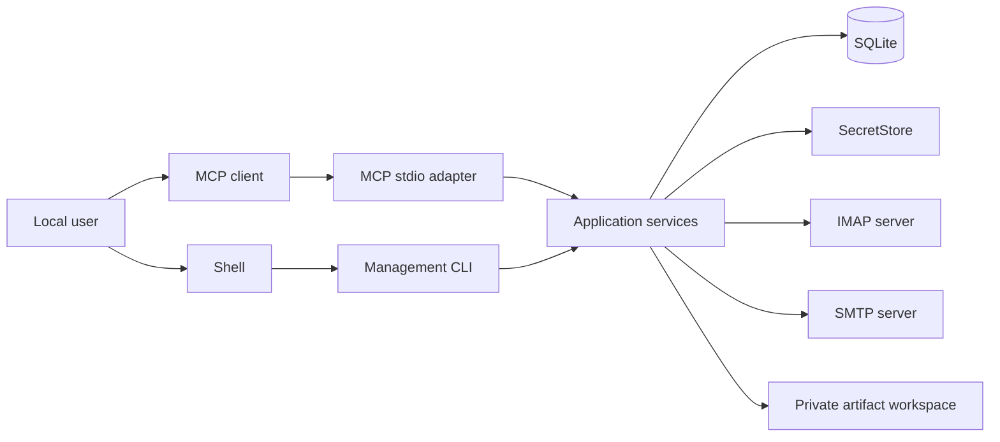
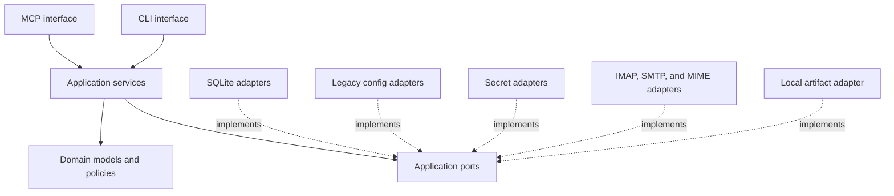

# Local Email App Architecture

Status: Proposed

This directory defines the target architecture for evolving `mcp-email-server`
into a local, single-user Email App. The application exposes email workflows to
MCP clients over stdio and exposes account, credential, index, cache, and
diagnostic management through a CLI.

These documents are design proposals. Current behavior remains defined by the
code, tests, and published documentation under [`docs/`](../docs/).

## Product Decisions

The following decisions apply to every detailed spec:

- The product is local and single-user.
- stdio is the only target MCP transport.
- MCP and CLI are peer adapters over the same application services.
- SQLite is the managed local store for non-secret account configuration,
  source-mapped operational account identities, mailbox and message metadata,
  search indexes, sync cursors, operation evidence, and bounded body cache.
- IMAP remains authoritative for mailbox state; SQLite is a local view, not a
  replacement mail server.
- Passwords, OAuth tokens, and provider API keys do not appear in ordinary
  SQLite tables. A `SecretStore` owns secret values and SQLite stores only
  opaque references.
- Existing TOML, environment-variable, and keyring behavior remains available
  as a compatibility mode and explicit import source.
- MCP tools use progressive disclosure: account and metadata discovery precede
  bounded body and attachment retrieval.
- Static tools plus complete text results form the cross-client compatibility
  baseline. Resources, prompts, structured output, and change notifications are
  optional enhancements.

## Explicit Non-goals

The proposal does not design:

- Streamable HTTP, SSE, or any other remote MCP transport;
- a hosted service, tenant model, remote authentication, or cloud secret store;
- a profile daemon or implicit background synchronization service;
- a web application or MCP App user interface;
- a database portability framework or interchangeable SQL engines;
- full offline mailbox replication;
- persistent raw MIME or attachment payloads by default.

The application core must not import FastMCP, which keeps an additional adapter
possible in principle, but no abstraction may be added solely for a hypothetical
HTTP or cloud deployment.

## Spec Map

1. [`01-system-context.md`](01-system-context.md) — product boundary, local
   process model, actors, goals, non-goals, and runtime ownership.
2. [`02-application-boundaries.md`](02-application-boundaries.md) — domain,
   application services, ports, adapters, composition, and dependency rules.
3. [`03-configuration-and-credentials.md`](03-configuration-and-credentials.md)
   — managed configuration, legacy compatibility, runtime overlays, secret
   backends, and CLI management contracts.
4. [`04-mail-workflows-and-consistency.md`](04-mail-workflows-and-consistency.md)
   — metadata refresh, search, body retrieval, send, mutation, retry, and local
   reconciliation semantics.
5. [`05-sqlite-persistence-and-data-model.md`](05-sqlite-persistence-and-data-model.md)
   — SQLite ownership, logical schema, search indexes, transactions, retention,
   migrations, and recovery.
6. [`06-mcp-interface-and-client-compatibility.md`](06-mcp-interface-and-client-compatibility.md)
   — MCP tool design, progressive disclosure, client capability evidence,
   output compatibility, annotations, and stdio validation.

There is intentionally no phased migration plan. Each implementation change
must preserve or explicitly version current public behavior, but sequencing
belongs in issues and pull requests rather than in the architecture contract.

## Architecture Shape

MCP owns agent-facing mail workflows. CLI owns local management workflows,
including secret input. Neither interface owns mail policy, persistence rules,
or protocol clients.

## Sources of Truth

| Data class                   | Source of truth                      | SQLite role                                                                                              |
| ---------------------------- | ------------------------------------ | -------------------------------------------------------------------------------------------------------- |
| Managed configuration        | SQLite                               | Authoritative non-secret accounts, policies, and rules                                                   |
| Legacy account configuration | TOML compatibility adapter           | Base config stays in TOML; SQLite stores only non-secret source-to-operational-ID mapping and index data |
| Environment overrides        | Process environment                  | Read-only runtime config; SQLite may retain only non-secret source identity and index data               |
| Passwords and tokens         | Selected `SecretStore`               | Opaque backend and locator only                                                                          |
| Mailbox and message state    | IMAP server                          | Rebuildable local index and cache                                                                        |
| SMTP delivery acceptance     | SMTP server response                 | Operation evidence and reconciliation state                                                              |
| Raw MIME and attachments     | IMAP server or explicit local export | Metadata only by default                                                                                 |

## Dependency Direction

Outer adapters depend on application contracts. Domain and application code do
not import FastMCP, Typer, sqlite3, keyring, aioimaplib, or aiosmtplib.

## Cross-cutting Invariants

- Tool and CLI handlers map inputs and outputs; they do not implement email
  policy or database transactions.
- One application command or query owns each user action.
- Network calls and secret-store calls never run inside SQLite transactions.
- A message placement is identified by account, mailbox, UIDVALIDITY, and UID;
  an IMAP UID alone is not durable.
- SMTP results preserve per-recipient acceptance, rejection, and uncertainty;
  accepted or unknown recipients are never automatically resubmitted.
- SMTP success is not rolled back when saving the sent copy fails, and an unknown
  sent-copy APPEND is reconciled before retry.
- Provider-effect operations atomically verify claim ownership and catalog
  generation while persisting each effect boundary; a stale post-boundary claim
  becomes unknown rather than being replayed.
- Body reads use IMAP PEEK unless the user explicitly requests a read mutation.
- Legacy and environment accounts may reuse stable SQLite operational identities,
  but their endpoints, policies, and secrets are never copied into managed
  configuration by index activity or an unrelated save.
- Secrets never appear in tool results, structured logs, database rows, or
  migration diagnostics.
- Managed credential changes use a persisted saga and a unique candidate locator;
  they never overwrite or delete the currently committed secret in place.
- Account removal keeps a tombstone and operational identity while credential
  cleanup or operation evidence remains; hard purge explicitly deletes eligible
  children before releasing the name.
- An active managed catalog materializes every required global security rule set;
  missing or invalid sets fail closed. Rule sets distinguish inherit,
  unrestricted, and explicit empty restriction; durable denies win and account
  rules cannot widen global authority, apart from documented process-local
  compatibility replacements.
- The tool catalog is stable for the life of a stdio session. Account capability
  changes are represented as data and call-time validation, not tool replacement.
- Every list, body, error, and artifact operation has an explicit size bound.

## Current Implementation Relationship

The current repository already provides stdio, mail workflows, TOML/environment
composition, keyring support, and bounded body reads. It does not yet provide
the architecture described here:

- `mcp_email_server/app.py` currently combines MCP registration, settings access,
  policy checks, handler dispatch, and response mapping.
- `mcp_email_server/config.py` currently combines stored configuration, runtime
  composition, resolved secrets, mutation, and a process-global cache.
- `db_location` exists, but no operational SQLite repository currently uses it.
- conditional tool visibility filters `tools/list` but does not notify clients
  when the list changes.
- the published `sse`, `streamable-http`, and Gradio `ui` commands remain legacy
  compatibility entry points; they are not part of the proposed runtime and
  require a separate versioned decision before removal or redirection.

Those statements describe the starting point, not a delivery sequence.

## Status Vocabulary

| Status        | Meaning                                                     |
| ------------- | ----------------------------------------------------------- |
| `Proposed`    | Under discussion; no implementation claim is made.          |
| `Accepted`    | Approved target; implementation may be incomplete.          |
| `Implemented` | Backed by code, tests, and aligned published documentation. |
| `Superseded`  | Replaced by a linked decision or spec.                      |

## Research Basis

The MCP interface design was checked on 2026-07-18 against the stable
[MCP 2025-11-25 specification](https://modelcontextprotocol.io/specification/2025-11-25)
and current official documentation for
[VS Code](https://code.visualstudio.com/api/extension-guides/ai/mcp),
[Cursor](https://cursor.com/docs/mcp),
[Claude Code](https://code.claude.com/docs/en/mcp), and
[OpenAI Codex](https://developers.openai.com/codex/mcp).
Detailed, claim-specific links are kept in
[`06-mcp-interface-and-client-compatibility.md`](06-mcp-interface-and-client-compatibility.md).
